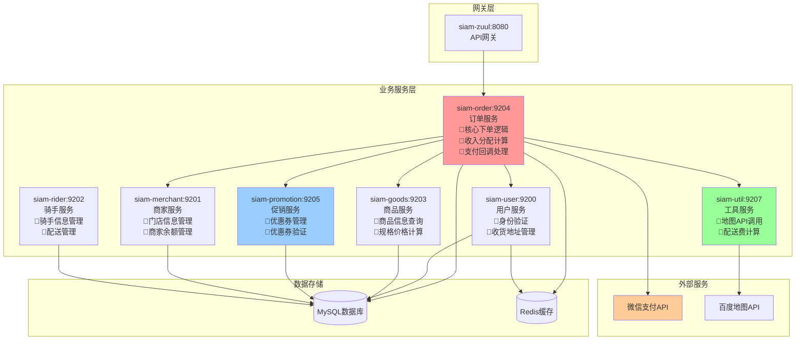
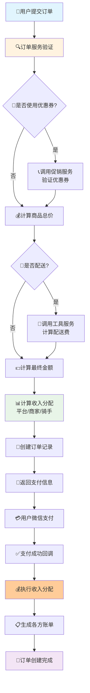
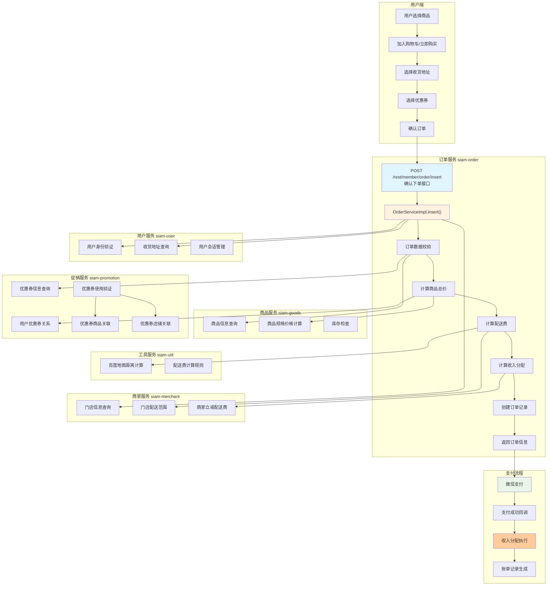
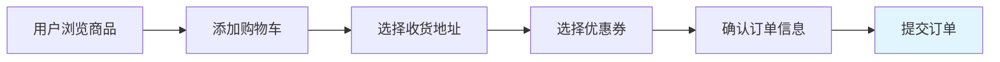
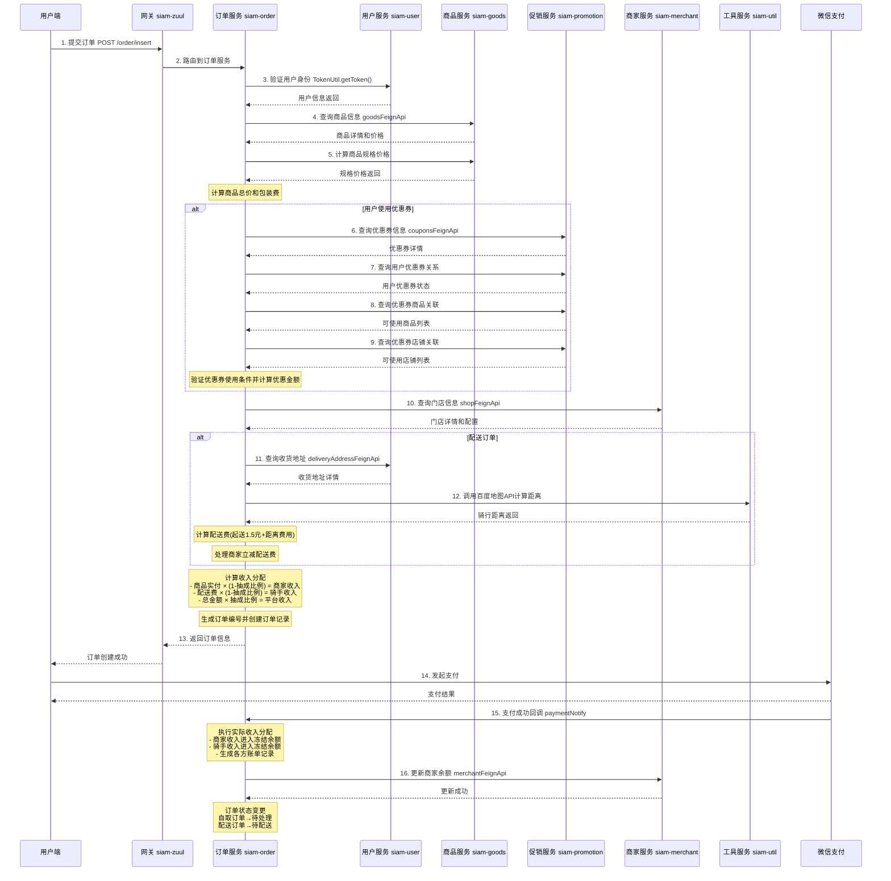

# 暹罗外卖系统整体流程设计

## 📋 系统概述

暹罗外卖系统采用Spring Cloud微服务架构，通过多个独立服务协同工作，提供完整的外卖下单、配送、支付和收入分配功能。

## 🏗️ 微服务架构

### 核心服务列表

| 服务名称 | 端口 | 职责 |
|---------|------|------|
| **siam-zuul** | 8080 | 网关服务，统一路由和权限控制 |
| **siam-order** | 9204 | 订单服务，核心业务逻辑 |
| **siam-user** | 9200 | 用户服务，用户信息和地址管理 |
| **siam-goods** | 9203 | 商品服务，商品信息和规格管理 |
| **siam-promotion** | 9205 | 促销服务，优惠券管理 |
| **siam-merchant** | 9201 | 商家服务，门店和商家信息 |
| **siam-rider** | 9202 | 骑手服务，骑手信息管理 |
| **siam-util** | 9207 | 工具服务，地图API和通用工具 |

## 🏗️ 系统架构图

### 微服务架构总览



## 🔄 完整业务流程

### 业务流程总览



### 详细服务交互流程



### 阶段一：用户下单流程



### 阶段二：订单处理流程（核心）

#### 2.1 订单服务入口
- **接口地址**: `POST /rest/member/order/insert`
- **服务**: `siam-order` (端口9204)
- **核心方法**: `OrderServiceImpl.insert()`

#### 2.2 服务调用序列

1. **用户身份验证**
   ```java
   // 调用用户服务验证Token
   Member loginMember = memberSessionManager.getSession(TokenUtil.getToken());
   ```

2. **商品信息验证**
   ```java
   // 调用商品服务获取商品详情
   Goods dbGoods = goodsFeignApi.selectByPrimaryKey(goodsId);
   // 计算商品规格价格
   BigDecimal specPrice = goodsSpecificationOptionFeignApi.selectSumPrice(...);
   ```

3. **优惠券处理** (来源: `siam-promotion`)
   ```java
   // 查询优惠券基本信息
   Coupons coupons = couponsFeignApi.selectByPrimaryKey(couponsId);
   // 查询用户优惠券关系
   CouponsMemberRelation relation = couponsMemberRelationFeignApi.select(...);
   // 验证优惠券商品关联
   List<Integer> goodsIds = couponsGoodsRelationFeignApi.getGoodsId(...);
   // 验证优惠券店铺关联
   List<Integer> shopIds = couponsShopRelationFeignApi.getShopId(...);
   ```

4. **门店信息查询**
   ```java
   // 调用商家服务获取门店信息
   Shop dbShop = shopFeignApi.selectByPrimaryKey(shopId);
   ```

5. **配送费计算** (配送订单)
   ```java
   // 获取收货地址
   DeliveryAddress address = deliveryAddressFeignApi.selectByPrimaryKey(addressId);
   // 调用地图API计算距离
   BigDecimal distance = baiduMapUtils.getTravelingDistance(...);
   // 计算配送费：起送1.5元 + 每增加1KM加1元
   BigDecimal deliveryFee = calculateDeliveryFee(distance);
   ```

6. **收入分配计算**
   ```java
   // 新规则：基于用户实际支付总金额统一抽成
   BigDecimal totalAmount = goodsActualAmount + deliveryFee;
   BigDecimal platformIncome = totalAmount × extractRatio;
   BigDecimal merchantIncome = goodsActualAmount × (1 - extractRatio);
   BigDecimal courierIncome = deliveryFee × (1 - extractRatio);
   ```

### 阶段三：支付和收入分配

#### 3.1 支付流程
- **微信支付**: 用户完成支付
- **回调处理**: `paymentNotify()` 方法

#### 3.2 收入分配执行
```java
// 商家收入进入冻结余额
merchant.orderFrozenBalance += merchantIncome;
// 骑手收入也暂时进入商家冻结余额(商家自配送)
merchant.orderFrozenBalance += courierIncome;
// 生成账单记录
createBillingRecord("订单收入", merchantIncome);
createBillingRecord("配送费收入", courierIncome);
```

## 💰 收入分配详细规则

### 计算公式

| 项目 | 计算公式 | 说明 |
|------|----------|------|
| **商品实付金额** | 商品原价 - 优惠券折扣 | 用户实际支付的商品费用 |
| **用户总支付** | 商品实付金额 + 配送费 | 用户实际支付总额 |
| **平台收入** | 商品实付 × 商户抽成比例 + 配送费 × 配送抽成比例 | 商户抽成比例按商户配置，订单创建时锁定入库 |
| **商家收入** | 商品实付金额 × (1 - 商户抽成比例) | 商户抽成比例可不同商户不同 |
| **骑手收入** | 配送费 × (1 - 配送抽成比例) | 配送抽成比例可平台统一/分区域 |

> 说明：商户抽成比例支持按商户单独配置（例如商家1=20%），并在“订单创建时”锁定到订单表，保证事后可追溯。

### 具体示例

**场景**: 30元商品，10元优惠券，2元配送费，10%抽成比例

```
商品实付 = 30 - 10 = 20元
用户总支付 = 20 + 2 = 22元
平台收入 = 22 × 10% = 2.2元
商家收入 = 20 × 90% = 18元
骑手收入 = 2 × 90% = 1.8元
验证: 2.2 + 18 + 1.8 = 22元 ✓
```

## 📊 详细调用序列图



## 🎯 关键接口列表

### 订单相关接口

| 接口 | 方法 | 描述 |
|------|------|------|
| `/rest/member/order/insert` | POST | 创建订单(核心接口) |
| `/rest/member/order/list` | POST | 订单列表查询 |
| `/rest/member/order/selectById` | POST | 订单详情查询 |
| `/rest/member/order/cancelOrder` | POST | 取消订单 |

### 服务间调用接口 (Feign)

| 服务调用 | 接口示例 |
|----------|----------|
| **商品服务** | `goodsFeignApi.selectByPrimaryKey()` |
| **用户服务** | `memberFeignApi.selectByPrimaryKey()` |
| **促销服务** | `couponsFeignApi.selectByPrimaryKey()` |
| **商家服务** | `shopFeignApi.selectByPrimaryKey()` |
| **工具服务** | `baiduMapUtils.getTravelingDistance()` |

## ⚙️ 配送费计算规则

### 距离计算
- **数据源**: 百度地图API骑行距离
- **起送价**: 1.5元 (0-1KM)
- **递增规则**: 每增加1KM加1元，向上取整
- **配送限制**: 超出5.5KM不予配送

### 商家立减支持
```java
if (商家立减金额 > 0) {
    if (商家立减金额 >= 总配送费) {
        商家承担配送费 = 总配送费;
        用户支付配送费 = 0;
    } else {
        商家承担配送费 = 商家立减金额;
        用户支付配送费 = 总配送费 - 商家立减金额;
    }
}
```

## 🔐 安全和容错机制

### 数据校验
- 前后端双重价格计算验证
- 优惠券使用条件严格校验  
- 库存和商品状态实时检查

### 事务保障
- 分布式事务支持(Seata)
- RocketMQ消息队列保障
- 本地消息表机制

### 异常处理
- 服务降级和熔断
- 订单超时自动取消
- 支付异常回滚机制

## 📊 监控指标

### 业务指标
- 订单转换率
- 平均订单金额
- 配送费收入占比
- 优惠券使用率

### 技术指标
- 服务响应时间
- 接口成功率
- 数据库连接池状态
- 消息队列堆积情况

## 🚀 扩展性设计

### 水平扩展
- 微服务独立部署
- 数据库读写分离
- Redis缓存集群

### 业务扩展
- 支持多种配送方式
- 灵活的抽成比例配置
- 多样化的优惠活动

---

**文档版本**: v1.0  
**创建时间**: 2024年  
**维护团队**: 技术架构组
