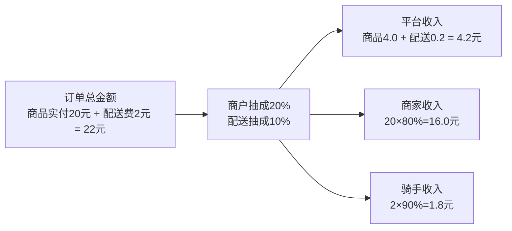

# 骑手服务收入分配规则设计

## 📋 业务背景

暹罗外卖系统采用商家自配送/平台配送并存模式，需对平台、商家、骑手进行合理结算。为满足不同商家的商务政策，抽成比例支持**按商户单独配置**（例如：商家1=20%），同时配送环节的抽成比例可独立配置。

## 🎯 核心规则

### 收入分配原则
- **分项抽成**：
  - 商品侧抽成比例=`merchant_commission_ratio`（可按商户配置）
  - 配送侧抽成比例=`delivery_commission_ratio`（平台统一，或按区域/活动配置）
- **统一口径**：所有计算基于用户实际支付金额（商品实付、配送费分别计算）。
- **可追溯**：订单维度落库具体比例，支持事后审计与对账。

### 计算公式

```
用户实际支付总金额 = 商品实付金额 + 配送费
平台收入 = 商品实付金额 × 商户抽成比例(merchant_commission_ratio)
         + 配送费 × 配送抽成比例(delivery_commission_ratio)
商家实际收入 = 商品实付金额 × (1 - merchant_commission_ratio)
骑手实际收入 = 配送费 × (1 - delivery_commission_ratio)
```

## 💰 收入分配示例

- 商品原价：30元
- 使用优惠券：10元
- 商品实付：20元
- 配送费：2元
- 商户抽成比例：20%
- 配送抽成比例：10%

分配结果：
```
平台收入 = 20×20% + 2×10% = 4.0 + 0.2 = 4.2元
商家收入 = 20×(1-20%) = 16.0元
骑手收入 = 2×(1-10%) = 1.8元
校验：4.2 + 16.0 + 1.8 = 22元 = 用户总支付
```

## 📊 收入分配可视化



## 🏗️ 核心落库设计

在订单维度落库当次结算所使用的比例，避免后续比例调整导致历史计算重放偏差。

```sql
-- tb_order 新增/调整字段
`goods_actual_amount` decimal(10,2) COMMENT '商品实付金额(扣除优惠后)',
`delivery_fee` decimal(10,2) COMMENT '配送费',
`total_actual_amount` decimal(10,2) COMMENT '用户实际支付总金额',
`merchant_commission_ratio` decimal(5,2) COMMENT '商户抽成比例(%)，下单时锁定',
`delivery_commission_ratio` decimal(5,2) COMMENT '配送抽成比例(%)，下单时锁定',
`platform_total_income` decimal(10,2) COMMENT '平台总收入(商品+配送)',
`merchant_actual_income` decimal(10,2) COMMENT '商家实际收入',
`courier_actual_income` decimal(10,2) COMMENT '骑手实际收入'
```

商户维度配置：
```sql
-- tb_merchant 新增字段
`merchant_commission_ratio` decimal(5,2) DEFAULT 20.00 COMMENT '商户默认抽成比例(%)'
```

## ⚙️ 技术实现（关键片段）

```java
public class IncomeDistributionCalculator {
    public DistributionResult calculate(BigDecimal goodsActualAmount,
                                        BigDecimal deliveryFee,
                                        BigDecimal merchantRatioPct,
                                        BigDecimal deliveryRatioPct) {
        BigDecimal merchantRatio = merchantRatioPct.divide(BigDecimal.valueOf(100), 4, RoundingMode.HALF_UP);
        BigDecimal deliveryRatio = deliveryRatioPct.divide(BigDecimal.valueOf(100), 4, RoundingMode.HALF_UP);

        BigDecimal platformFromGoods = goodsActualAmount.multiply(merchantRatio);
        BigDecimal platformFromDelivery = deliveryFee.multiply(deliveryRatio);
        BigDecimal platformIncome = platformFromGoods.add(platformFromDelivery);

        BigDecimal merchantIncome = goodsActualAmount.multiply(BigDecimal.ONE.subtract(merchantRatio));
        BigDecimal courierIncome = deliveryFee.multiply(BigDecimal.ONE.subtract(deliveryRatio));
        return new DistributionResult(platformIncome, merchantIncome, courierIncome);
    }
}
```

下单时锁定比例：
```java
// 读取商户抽成比例（若商户未配置则使用平台默认）
BigDecimal merchantRatio = Optional.ofNullable(merchant.getCommissionRatio())
    .orElse(platformDefaultMerchantRatio);

// 配送抽成比例（全局或按城市）
BigDecimal deliveryRatio = platformDeliveryRatio;

order.setMerchantCommissionRatio(merchantRatio);
order.setDeliveryCommissionRatio(deliveryRatio);
```

## 🔧 配置参数建议

```yaml
commission:
  merchant-default: 20.0   # 商户默认抽成比例(%)，可被商户自定义覆盖
  delivery-default: 10.0   # 配送抽成比例(%)
```

---
**要点**：抽成比例“当次订单锁定入库 + 商户级可配置”，保证灵活性与可追溯性。
