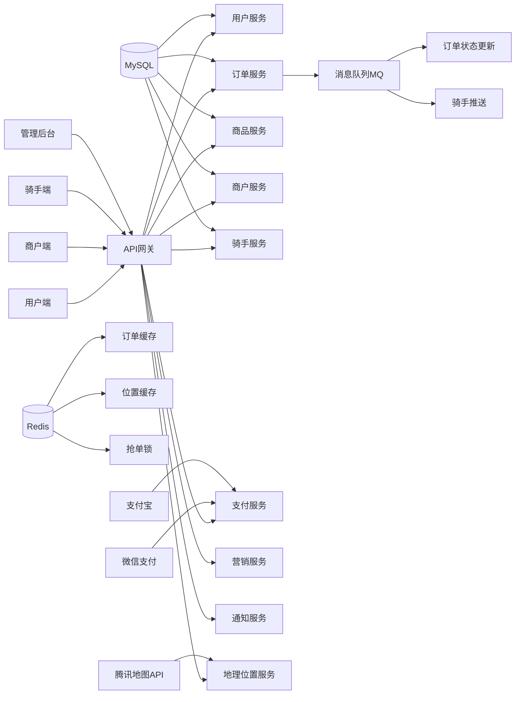
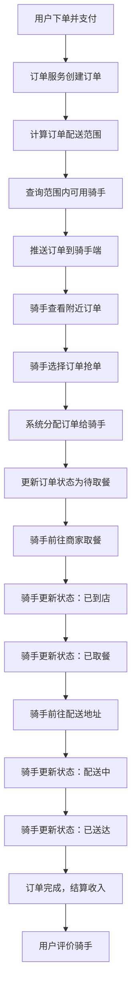
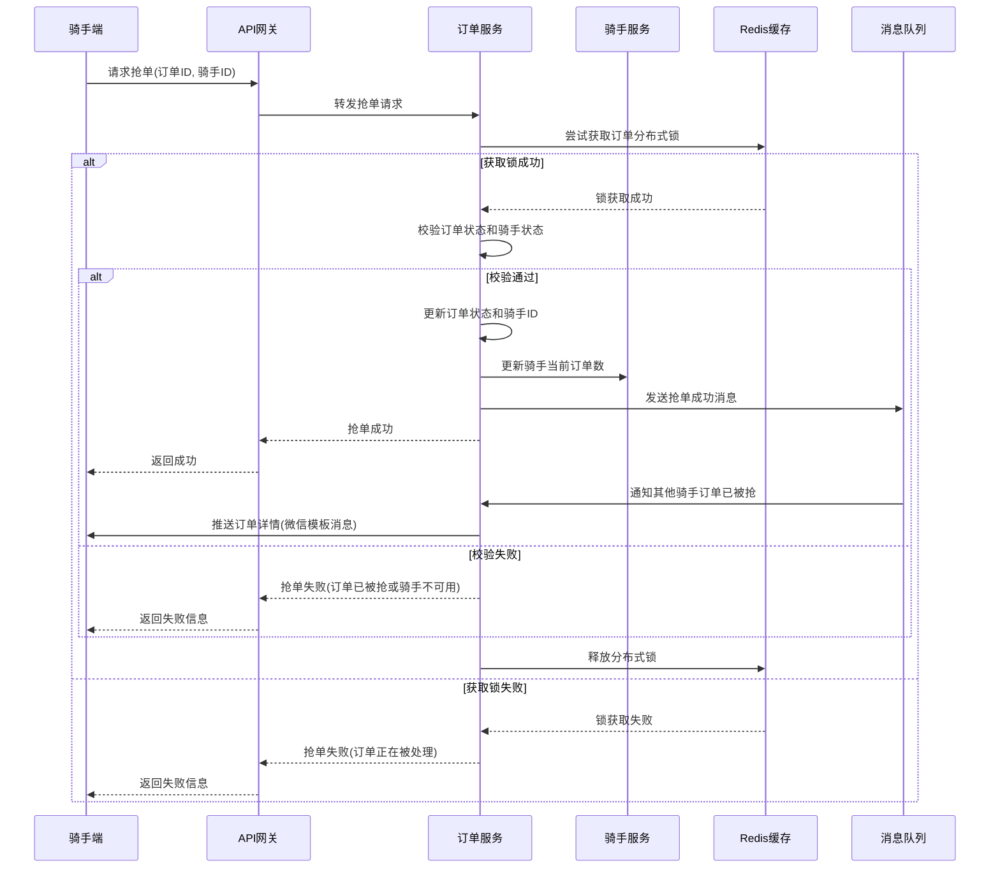
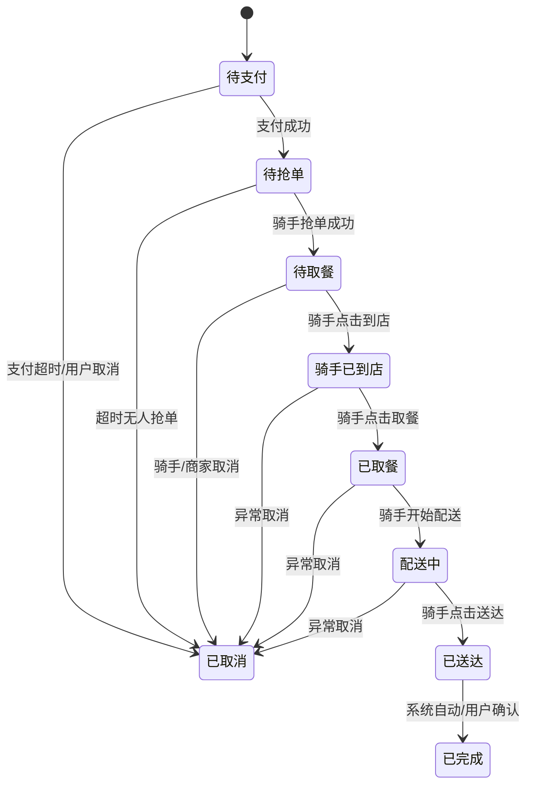
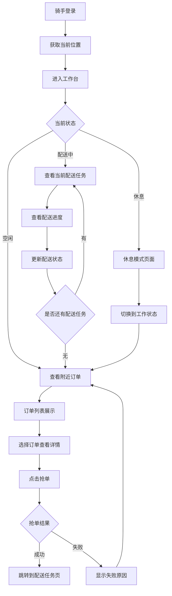
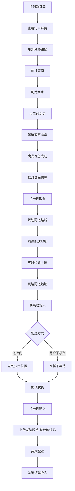
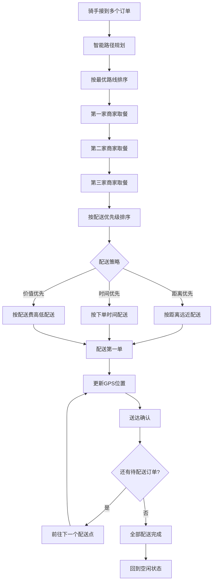
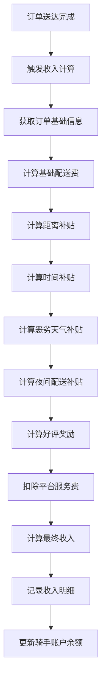
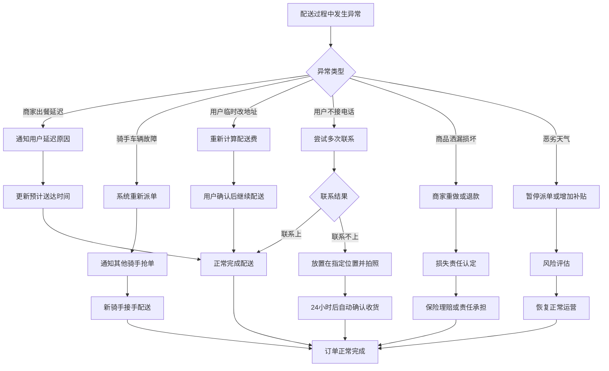
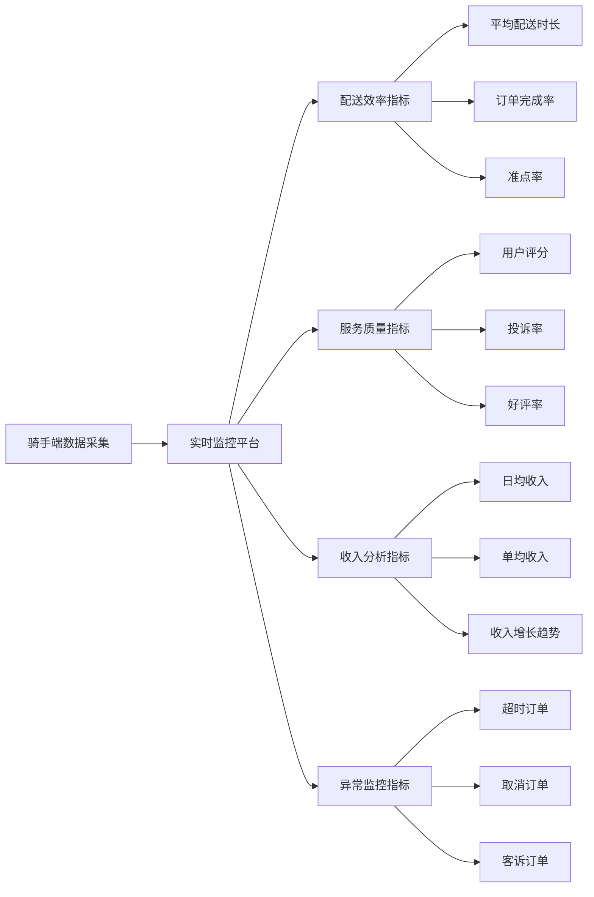

# 贡享臻选2.0 - 骑手抢单配送系统设计

## 项目概述

贡享臻选2.0是一个外卖+电商+团购的综合平台，本文档专注于**微信小程序端**骑手抢单配送系统的设计，参考美团等主流外卖平台的运营模式。

### 🔧 技术架构说明

- **前端**: 微信小程序（用户端、骑手端、商户端）
- **通信方式**: HTTP轮询 + 微信模板消息推送（无WebSocket）
- **位置服务**: 小程序原生API + 腾讯地图
- **推送通知**: 微信模板消息/订阅消息

## 核心功能模块

### 1. 骑手端核心功能

- **订单抢单/接单**：实时订单推送，骑手主动抢单
- **订单派送列表**：当前配送任务管理
- **路线导航**：配送路径优化和导航
- **任务中心**：历史订单、收入统计
- **配送状态更新**：到店/取餐/配送中/已送达
- **账户管理**：收入明细、提现功能
- **服务评分**：用户评价查看

### 2. 系统架构设计

#### 微服务架构总览



## 骑手抢单流程设计

### 1. 整体业务流程



### 2. 基于位置的附近订单查询

#### 数据库表设计

```sql
-- 订单表
CREATE TABLE `tb_order` (
    `id` int NOT NULL AUTO_INCREMENT,
    `order_no` varchar(50) NOT NULL COMMENT '订单号',
    `user_id` int NOT NULL COMMENT '用户ID',
    `shop_id` int NOT NULL COMMENT '商家ID',
    `shop_longitude` decimal(10,7) NOT NULL COMMENT '商家经度',
    `shop_latitude` decimal(10,7) NOT NULL COMMENT '商家纬度',
    `delivery_longitude` decimal(10,7) NOT NULL COMMENT '配送地址经度',
    `delivery_latitude` decimal(10,7) NOT NULL COMMENT '配送地址纬度',
    `delivery_fee` decimal(8,2) NOT NULL COMMENT '配送费',
    `distance` decimal(8,2) NOT NULL COMMENT '配送距离(公里)',
    `status` tinyint NOT NULL DEFAULT 1 COMMENT '订单状态',
    `rider_id` int DEFAULT NULL COMMENT '骑手ID',
    `expected_delivery_time` int NOT NULL COMMENT '预计配送时长(分钟)',
    `created_time` datetime NOT NULL,
    `grab_deadline` datetime NOT NULL COMMENT '抢单截止时间',
    PRIMARY KEY (`id`),
    KEY `idx_grab_orders` (`status`, `grab_deadline`, `shop_longitude`, `shop_latitude`)
) ENGINE=InnoDB DEFAULT CHARSET=utf8mb4 COMMENT='订单表';

-- 骑手表
CREATE TABLE `tb_rider` (
    `id` int NOT NULL AUTO_INCREMENT,
    `phone` varchar(20) NOT NULL COMMENT '手机号',
    `name` varchar(50) NOT NULL COMMENT '姓名',
    `current_longitude` decimal(10,7) DEFAULT NULL COMMENT '当前经度',
    `current_latitude` decimal(10,7) DEFAULT NULL COMMENT '当前纬度',
    `status` tinyint NOT NULL DEFAULT 1 COMMENT '骑手状态：1=空闲，2=配送中，3=休息',
    `max_concurrent_orders` tinyint NOT NULL DEFAULT 3 COMMENT '最大并发订单数',
    `current_orders_count` tinyint NOT NULL DEFAULT 0 COMMENT '当前配送订单数',
    `service_range` decimal(5,2) NOT NULL DEFAULT 5.0 COMMENT '服务范围(公里)',
    PRIMARY KEY (`id`),
    UNIQUE KEY `uk_phone` (`phone`),
    KEY `idx_location_status` (`status`, `current_longitude`, `current_latitude`)
) ENGINE=InnoDB DEFAULT CHARSET=utf8mb4 COMMENT='骑手表';
```

#### 附近订单查询算法

```java
/**
 * 骑手查询附近可抢订单
 * @param riderLng 骑手经度
 * @param riderLat 骑手纬度
 * @param serviceRange 服务范围(公里)
 * @return 可抢订单列表
 */
public List<OrderVO> findNearbyGrabbableOrders(BigDecimal riderLng, BigDecimal riderLat, BigDecimal serviceRange) {
    // 1. 计算经纬度范围（快速筛选）
    BigDecimal lngDelta = serviceRange.divide(new BigDecimal("111.320"), 6, RoundingMode.HALF_UP);
    BigDecimal latDelta = serviceRange.divide(new BigDecimal("110.540"), 6, RoundingMode.HALF_UP);
    
    BigDecimal minLng = riderLng.subtract(lngDelta);
    BigDecimal maxLng = riderLng.add(lngDelta);
    BigDecimal minLat = riderLat.subtract(latDelta);
    BigDecimal maxLat = riderLat.add(latDelta);
    
    // 2. SQL查询可抢订单
    String sql = """
        SELECT 
            o.*,
            (6371 * 2 * ASIN(SQRT(
                POWER(SIN((? - shop_latitude) * PI() / 180 / 2), 2) +
                COS(? * PI() / 180) * COS(shop_latitude * PI() / 180) *
                POWER(SIN((? - shop_longitude) * PI() / 180 / 2), 2)
            ))) as shop_distance
        FROM tb_order o
        WHERE o.status = 2  -- 待抢单状态
            AND o.rider_id IS NULL
            AND o.grab_deadline > NOW()
            AND o.shop_longitude BETWEEN ? AND ?
            AND o.shop_latitude BETWEEN ? AND ?
        HAVING shop_distance <= ?
        ORDER BY 
            o.delivery_fee DESC,  -- 配送费高的优先
            shop_distance ASC,    -- 距离近的优先
            o.created_time ASC    -- 下单早的优先
        LIMIT 20
        """;
    
    return orderMapper.selectNearbyOrders(sql, riderLat, riderLat, riderLng, 
                                         minLng, maxLng, minLat, maxLat, serviceRange);
}
```

### 3. 抢单机制设计

#### 抢单流程



#### 防止重复抢单的Redis锁机制

```java
@Service
public class OrderGrabService {
    
    @Autowired
    private RedisTemplate<String, String> redisTemplate;
    
    /**
     * 骑手抢单
     */
    @Transactional(rollbackFor = Exception.class)
    public Result<String> grabOrder(Integer orderId, Integer riderId) {
        String lockKey = "order:grab:lock:" + orderId;
        String lockValue = riderId + ":" + System.currentTimeMillis();
        
        try {
            // 1. 获取分布式锁，30秒过期
            Boolean lockAcquired = redisTemplate.opsForValue()
                .setIfAbsent(lockKey, lockValue, Duration.ofSeconds(30));
            
            if (!lockAcquired) {
                return Result.fail("该订单正在被处理，请稍后重试");
            }
            
            // 2. 校验订单状态
            Order order = orderMapper.selectById(orderId);
            if (order == null || order.getRiderId() != null) {
                return Result.fail("订单不存在或已被抢");
            }
            
            if (order.getStatus() != OrderStatus.WAIT_GRAB) {
                return Result.fail("订单状态不允许抢单");
            }
            
            if (order.getGrabDeadline().before(new Date())) {
                return Result.fail("抢单时间已过期");
            }
            
            // 3. 校验骑手状态
            Rider rider = riderMapper.selectById(riderId);
            if (rider == null || rider.getStatus() != RiderStatus.AVAILABLE) {
                return Result.fail("骑手状态不可用");
            }
            
            if (rider.getCurrentOrdersCount() >= rider.getMaxConcurrentOrders()) {
                return Result.fail("当前配送订单已达上限");
            }
            
            // 4. 更新订单和骑手状态
            order.setRiderId(riderId);
            order.setStatus(OrderStatus.WAIT_PICKUP);
            order.setGrabTime(new Date());
            orderMapper.updateById(order);
            
            rider.setCurrentOrdersCount(rider.getCurrentOrdersCount() + 1);
            riderMapper.updateById(rider);
            
            // 5. 发送消息通知
            OrderGrabMessage message = new OrderGrabMessage();
            message.setOrderId(orderId);
            message.setRiderId(riderId);
            message.setGrabTime(new Date());
            mqProducer.sendMessage("order.grab.success", message);
            
            return Result.success("抢单成功");
            
        } finally {
            // 释放锁
            String currentValue = redisTemplate.opsForValue().get(lockKey);
            if (lockValue.equals(currentValue)) {
                redisTemplate.delete(lockKey);
            }
        }
    }
}
```

### 4. 配送状态机设计

#### 订单状态枚举

```java
public enum OrderStatus {
    WAIT_PAYMENT(1, "待支付"),
    WAIT_GRAB(2, "待抢单"),
    WAIT_PICKUP(3, "待取餐"),
    RIDER_ARRIVED(4, "骑手已到店"),
    PICKED_UP(5, "已取餐"),
    DELIVERING(6, "配送中"),
    DELIVERED(7, "已送达"),
    COMPLETED(8, "已完成"),
    CANCELLED(9, "已取消");
}
```

#### 状态更新流程



#### 状态更新API设计

```java
@RestController
@RequestMapping("/api/rider/order")
public class RiderOrderController {
    
    /**
     * 更新配送状态
     */
    @PostMapping("/update-status")
    public Result<String> updateDeliveryStatus(@RequestBody UpdateStatusRequest request) {
        // 1. 校验骑手权限
        if (!validateRiderPermission(request.getRiderId(), request.getOrderId())) {
            return Result.fail("无权操作此订单");
        }
        
        // 2. 状态机校验和更新
        OrderStatus currentStatus = orderService.getOrderStatus(request.getOrderId());
        OrderStatus targetStatus = request.getTargetStatus();
        
        if (!isValidStatusTransition(currentStatus, targetStatus)) {
            return Result.fail("状态转换不合法");
        }
        
        // 3. 执行状态更新
        switch (targetStatus) {
            case RIDER_ARRIVED:
                return handleRiderArrived(request);
            case PICKED_UP:
                return handlePickedUp(request);
            case DELIVERING:
                return handleDelivering(request);
            case DELIVERED:
                return handleDelivered(request);
            default:
                return Result.fail("不支持的状态更新");
        }
    }
    
    /**
     * 骑手已到店
     */
    private Result<String> handleRiderArrived(UpdateStatusRequest request) {
        Order order = orderService.getById(request.getOrderId());
        
        // 更新订单状态
        order.setStatus(OrderStatus.RIDER_ARRIVED.getCode());
        order.setArriveTime(new Date());
        if (request.getLongitude() != null && request.getLatitude() != null) {
            order.setArriveLocation(request.getLongitude() + "," + request.getLatitude());
        }
        orderService.updateById(order);
        
        // 通知商家准备商品
        notificationService.notifyMerchant(order.getShopId(), "骑手已到店，请准备商品", order);
        
        // 通知用户
        notificationService.notifyUser(order.getUserId(), "骑手已到店取餐", order);
        
        return Result.success("状态更新成功");
    }
    
    /**
     * 已取餐，开始配送
     */
    private Result<String> handlePickedUp(UpdateStatusRequest request) {
        Order order = orderService.getById(request.getOrderId());
        
        // 更新订单状态
        order.setStatus(OrderStatus.PICKED_UP.getCode());
        order.setPickupTime(new Date());
        orderService.updateById(order);
        
        // 自动转为配送中状态
        order.setStatus(OrderStatus.DELIVERING.getCode());
        order.setDeliveryStartTime(new Date());
        orderService.updateById(order);
        
        // 通知用户开始配送
        notificationService.notifyUser(order.getUserId(), "骑手已取餐，正在为您配送", order);
        
        // 开启实时位置追踪
        locationTrackingService.startTracking(request.getRiderId(), request.getOrderId());
        
        return Result.success("开始配送");
    }
    
    /**
     * 送达确认
     */
    private Result<String> handleDelivered(UpdateStatusRequest request) {
        Order order = orderService.getById(request.getOrderId());
        
        // 更新订单状态
        order.setStatus(OrderStatus.DELIVERED.getCode());
        order.setDeliveredTime(new Date());
        if (request.getLongitude() != null && request.getLatitude() != null) {
            order.setDeliveredLocation(request.getLongitude() + "," + request.getLatitude());
        }
        orderService.updateById(order);
        
        // 更新骑手状态
        Rider rider = riderService.getById(request.getRiderId());
        rider.setCurrentOrdersCount(rider.getCurrentOrdersCount() - 1);
        riderService.updateById(rider);
        
        // 停止位置追踪
        locationTrackingService.stopTracking(request.getRiderId(), request.getOrderId());
        
        // 通知用户确认收货
        notificationService.notifyUser(order.getUserId(), "订单已送达，请确认收货", order);
        
        // 计算骑手收入
        riderIncomeService.calculateIncome(request.getRiderId(), request.getOrderId());
        
        // 15分钟后自动完成订单
        delayedTaskService.scheduleOrderCompletion(request.getOrderId(), 15 * 60 * 1000);
        
        return Result.success("订单已送达");
    }
}
```

### 5. 微信小程序位置追踪

#### 骑手位置上报机制

```java
@RestController
@RequestMapping("/api/rider/location")
public class RiderLocationController {
    
    @Autowired
    private RedisTemplate<String, String> redisTemplate;
    
    @Autowired
    private WeChatPushService weChatPushService;
    
    /**
     * 骑手定时上报位置
     */
    @PostMapping("/update")
    public Result<String> updateLocation(@RequestBody LocationUpdateRequest request) {
        // 1. 校验骑手权限
        if (!validateRiderPermission(request.getRiderId())) {
            return Result.fail("权限验证失败");
        }
        
        // 2. 更新Redis中的骑手实时位置
        String locationKey = "rider:location:" + request.getRiderId();
        LocationInfo locationInfo = new LocationInfo();
        locationInfo.setLongitude(request.getLongitude());
        locationInfo.setLatitude(request.getLatitude());
        locationInfo.setUpdateTime(new Date());
        locationInfo.setAccuracy(request.getAccuracy());
        
        redisTemplate.opsForValue().set(locationKey, 
            JSON.toJSONString(locationInfo), Duration.ofMinutes(5));
        
        // 3. 添加到地理位置索引
        redisTemplate.opsForGeo().add("rider:locations", 
            new Point(request.getLongitude(), request.getLatitude()), 
            request.getRiderId().toString());
        
        // 4. 推送位置更新给关注的用户（通过微信小程序订阅消息）
        List<Integer> trackingUsers = orderService.getUsersTrackingRider(request.getRiderId());
        for (Integer userId : trackingUsers) {
            weChatPushService.sendLocationUpdate(userId, locationInfo, request.getRiderId());
        }
        
        return Result.success("位置更新成功");
    }
    
    /**
     * 用户查询骑手实时位置
     */
    @PostMapping("/query")
    public Result<LocationInfo> queryRiderLocation(@RequestBody LocationQueryRequest request) {
        // 1. 校验用户是否有权限查看该骑手位置
        if (!orderService.canUserTrackRider(request.getUserId(), request.getRiderId())) {
            return Result.fail("无权限查看该骑手位置");
        }
        
        // 2. 从Redis获取骑手最新位置
        String locationKey = "rider:location:" + request.getRiderId();
        String locationStr = redisTemplate.opsForValue().get(locationKey);
        
        if (StringUtils.isEmpty(locationStr)) {
            return Result.fail("骑手位置信息不存在或已过期");
        }
        
        LocationInfo locationInfo = JSON.parseObject(locationStr, LocationInfo.class);
        
        // 3. 计算预计到达时间
        if (request.getDestinationLng() != null && request.getDestinationLat() != null) {
            Integer estimatedTime = mapService.calculateETA(
                locationInfo.getLongitude(), locationInfo.getLatitude(),
                request.getDestinationLng(), request.getDestinationLat()
            );
            locationInfo.setEstimatedTime(estimatedTime);
        }
        
        return Result.success(locationInfo);
    }
}
```

#### 微信小程序端位置上报

```javascript
// 骑手小程序 - 定时上报位置
const LocationReporter = {
  timer: null,
  
  // 开始位置上报
  startReporting() {
    this.timer = setInterval(() => {
      this.reportLocation();
    }, 10000); // 每10秒上报一次位置
  },
  
  // 上报位置
  reportLocation() {
    wx.getLocation({
      type: 'gcj02',
      success: (res) => {
        wx.request({
          url: 'https://api.example.com/api/rider/location/update',
          method: 'POST',
          data: {
            riderId: wx.getStorageSync('riderId'),
            longitude: res.longitude,
            latitude: res.latitude,
            accuracy: res.accuracy,
            timestamp: Date.now()
          },
          success: (result) => {
            console.log('位置上报成功', result);
          },
          fail: (error) => {
            console.error('位置上报失败', error);
          }
        });
      },
      fail: (error) => {
        console.error('获取位置失败', error);
      }
    });
  },
  
  // 停止位置上报
  stopReporting() {
    if (this.timer) {
      clearInterval(this.timer);
      this.timer = null;
    }
  }
};

// 用户小程序 - 轮询查询骑手位置
const LocationTracker = {
  timer: null,
  
  // 开始追踪骑手位置
  startTracking(riderId) {
    this.timer = setInterval(() => {
      this.queryRiderLocation(riderId);
    }, 5000); // 每5秒查询一次骑手位置
  },
  
  // 查询骑手位置
  queryRiderLocation(riderId) {
    wx.request({
      url: 'https://api.example.com/api/rider/location/query',
      method: 'POST',
      data: {
        userId: wx.getStorageSync('userId'),
        riderId: riderId,
        destinationLng: this.data.deliveryLng,
        destinationLat: this.data.deliveryLat
      },
      success: (res) => {
        if (res.data.success) {
          // 更新地图上的骑手位置
          this.updateRiderMarker(res.data.data);
          // 更新预计到达时间
          this.updateETA(res.data.data.estimatedTime);
        }
      }
    });
  },
  
  // 停止追踪
  stopTracking() {
    if (this.timer) {
      clearInterval(this.timer);
      this.timer = null;
    }
  }
};
```

#### 微信推送服务实现

```java
@Service
public class WeChatPushService {
    
    @Autowired
    private WeChatApiService weChatApiService;
    
    /**
     * 发送订单抢单成功通知
     */
    public void sendOrderGrabNotification(Integer riderId, Order order) {
        try {
            Rider rider = riderService.getById(riderId);
            if (rider == null || StringUtils.isEmpty(rider.getOpenId())) {
                return;
            }
            
            // 构建模板消息
            Map<String, Object> data = new HashMap<>();
            data.put("keyword1", new TemplateData(order.getOrderNo()));
            data.put("keyword2", new TemplateData(order.getShopName()));
            data.put("keyword3", new TemplateData(order.getDeliveryFee() + "元"));
            data.put("keyword4", new TemplateData("请尽快前往商家取餐"));
            
            TemplateMessage message = new TemplateMessage();
            message.setTouser(rider.getOpenId());
            message.setTemplate_id("ORDER_GRAB_SUCCESS_TEMPLATE_ID");
            message.setData(data);
            message.setMiniprogram(new MiniProgram("your-miniprogram-appid", 
                "pages/order/detail?orderId=" + order.getId()));
            
            weChatApiService.sendTemplateMessage(message);
            
        } catch (Exception e) {
            log.error("发送抢单成功通知失败", e);
        }
    }
    
    /**
     * 发送配送状态更新通知给用户
     */
    public void sendDeliveryStatusUpdate(Integer userId, String status, Order order) {
        try {
            User user = userService.getById(userId);
            if (user == null || StringUtils.isEmpty(user.getOpenId())) {
                return;
            }
            
            String statusText = getStatusText(status);
            
            Map<String, Object> data = new HashMap<>();
            data.put("keyword1", new TemplateData(order.getOrderNo()));
            data.put("keyword2", new TemplateData(statusText));
            data.put("keyword3", new TemplateData(new Date()));
            data.put("keyword4", new TemplateData("点击查看详情"));
            
            TemplateMessage message = new TemplateMessage();
            message.setTouser(user.getOpenId());
            message.setTemplate_id("DELIVERY_STATUS_UPDATE_TEMPLATE_ID");
            message.setData(data);
            message.setMiniprogram(new MiniProgram("your-user-miniprogram-appid", 
                "pages/order/tracking?orderId=" + order.getId()));
            
            weChatApiService.sendTemplateMessage(message);
            
        } catch (Exception e) {
            log.error("发送配送状态更新通知失败", e);
        }
    }
    
    private String getStatusText(String status) {
        switch (status) {
            case "RIDER_ARRIVED": return "骑手已到店";
            case "PICKED_UP": return "骑手已取餐";
            case "DELIVERING": return "正在配送中";
            case "DELIVERED": return "订单已送达";
            default: return "状态已更新";
        }
    }
}
```

### 6. 骑手端详细操作流程

#### 骑手工作台页面流程



#### 配送任务执行流程



#### 多订单并行配送流程



### 7. 收入结算系统详细设计

#### 收入计算规则



#### 收入结算公式

```
骑手实际收入 = 基础配送费 + 距离补贴 + 时间补贴 + 天气补贴 + 夜间补贴 + 好评奖励 - 平台服务费

其中：
- 商户抽成比例：按商户单独配置（例如商家1=20%），在订单创建时锁定入库；
- 基础配送费 = 订单配送费 × (1 - 配送抽成比例)
- 平台商品抽成 = 商品实付 × 商户抽成比例
- 平台配送抽成 = 配送费 × 配送抽成比例
```

### 8. 异常处理机制

#### 订单异常处理流程



### 9. 系统监控和数据分析

#### 关键指标监控



### 10. 技术实现要点

#### 关键技术选型

| 技术组件 | 选型方案 | 用途说明 |
|---------|---------|----------|
| 位置服务 | 腾讯地图API | 地理定位、距离计算、路径规划 |
| 实时通信 | 轮询 + 微信推送 | 订单推送、状态更新 |
| 分布式锁 | Redis + Redisson | 防止订单重复抢占 |
| 消息队列 | RocketMQ | 异步处理、削峰填谷 |
| 数据库 | MySQL + Redis | 关系数据存储 + 缓存 |
| 搜索引擎 | Elasticsearch | 地理位置搜索优化 |
| 监控系统 | Prometheus + Grafana | 性能监控、数据展示 |

#### 性能优化策略

1. **地理位置查询优化**
   - 使用GeoHash算法提高查询效率
   - Redis Geo数据结构存储实时位置
   - 建立合适的数据库空间索引

2. **订单推送优化**
   - 基于骑手位置的智能推送
   - 微信推送服务管理和限频
   - 轮询频率优化和消息去重

3. **并发控制优化**
   - 分布式锁的超时和重试机制
   - 数据库连接池优化
   - 缓存穿透和雪崩防护

## 总结

这个贡享臻选2.0骑手抢单配送系统设计方案包含了：

### 核心功能模块
1. **智能抢单机制**：基于地理位置的订单推荐和分布式抢单
2. **完整配送流程**：从接单到送达的全状态管理
3. **位置追踪**：用户可通过轮询查看配送进度
4. **收入结算系统**：公平透明的收入分配机制
5. **异常处理机制**：完善的异常情况处理流程

### 技术特色
1. **微信生态**：完全基于微信小程序，无需额外APP
2. **高性能**：分布式架构，支持大并发
3. **高可用**：异常容错，服务降级
4. **智能化**：AI路径规划，智能推荐
5. **推送及时**：微信模板消息保证通知到达

### 业务价值
1. **提升效率**：减少空跑时间，提高配送效率
2. **增加收入**：合理的激励机制，提升骑手积极性
3. **优化体验**：实时透明，提升用户满意度
4. **降低成本**：智能调度，降低运营成本

该设计方案参考了美团、饿了么等主流外卖平台的成熟经验，结合贡享臻选2.0项目的具体需求，是一个完整可行的技术解决方案。

