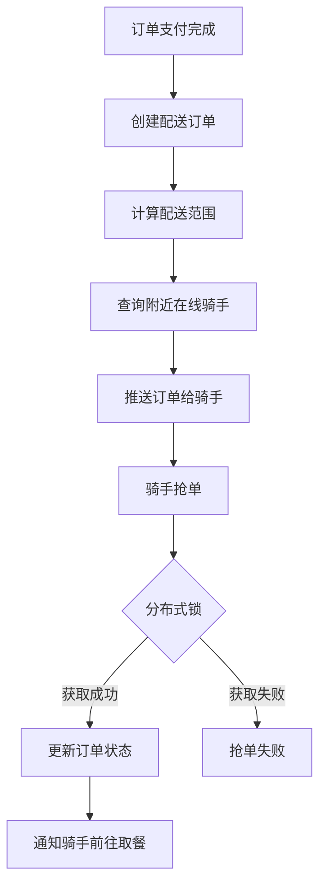
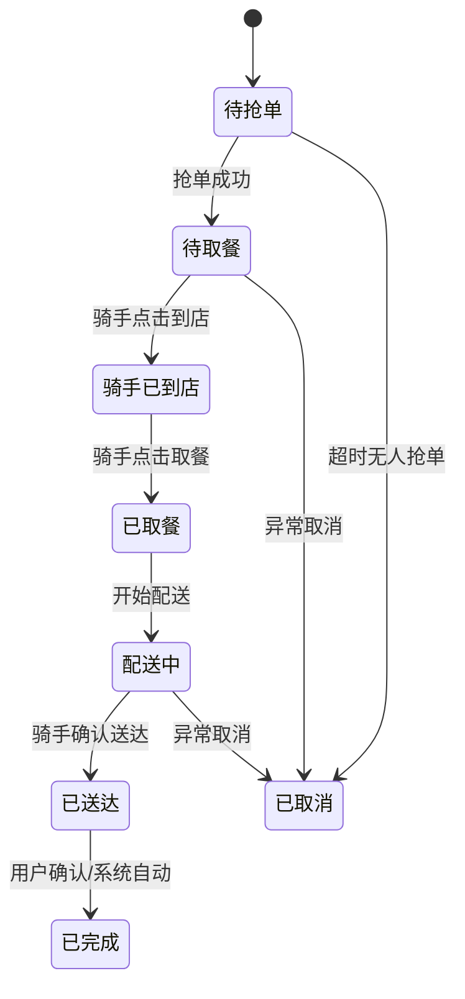

# 贡享臻选骑手模块开发规划

## 📋 项目概述

基于贡享臻选微服务架构，开发完整的骑手抢单配送系统，实现美团式外卖配送模式。

### 🎯 核心目标
- ✅ 骑手注册和认证管理
- ✅ 基于地理位置的智能订单推送
- ✅ Redis分布式锁防重复抢单
- ✅ 配送状态实时追踪
- ✅ 收入结算和统计分析

## 🏗️ 系统架构

### 服务划分
```
gxz-delivery (配送服务)
├── delivery-api/           # API 接口定义
│   ├── dto/               # 数据传输对象
│   ├── vo/                # 视图对象  
│   ├── enums/             # 枚举定义
│   └── feign/             # Feign 客户端
└── delivery-provider/      # 服务实现
    ├── controller/        # 控制器层
    ├── service/           # 服务层
    ├── mapper/            # 数据访问层
    ├── entity/            # 实体类
    └── config/            # 配置类

gxz-settlement (结算服务)
└── 骑手收入计算和结算
```

## 🚀 分阶段开发计划

### Phase 1: 基础骑手管理 (1周)

#### 已完成 ✅
- [x] 骑手实体类设计 (Rider.java)
- [x] 配送订单实体类 (DeliveryOrder.java)
- [x] 状态枚举定义 (RiderStatus, DeliveryOrderStatus)
- [x] 骑手管理服务实现 (RiderServiceImpl.java)
- [x] 基础DTO/VO定义

#### 待完成 🔲
```java
// 数据访问层
RiderMapper.java
DeliveryOrderMapper.java

// 服务接口定义
RiderService.java
OrderGrabService.java

// 配置文件
application.yml
redis配置
数据库配置
```

### Phase 2: 抢单核心逻辑 (1.5周)

#### 已完成 ✅
- [x] 抢单服务实现 (OrderGrabServiceImpl.java)
- [x] 分布式锁防重复抢单
- [x] 地理位置查询算法
- [x] 配送状态机设计

#### 待完成 🔲
```java
// 位置追踪服务
LocationTrackingService.java
- 骑手位置上报
- 实时位置缓存
- 轨迹记录

// 微信推送服务  
WeChatNotificationService.java
- 抢单成功通知
- 订单状态推送
- 模板消息发送
```

### Phase 3: API接口完善 (1周)

#### 已完成 ✅
- [x] 骑手管理控制器 (RiderController.java)

#### 待完成 🔲
```java
// 完善控制器功能
- 骑手历史订单查询
- 收入统计接口
- 评价查看接口

// 新增控制器
LocationController.java      # 位置相关接口
IncomeController.java        # 收入相关接口
RatingController.java        # 评价相关接口
```

### Phase 4: 收入结算系统 (1.5周)

```java
// 收入计算服务
RiderIncomeService.java
- 基础配送费计算
- 距离补贴计算  
- 时间/天气/夜间补贴
- 好评奖励计算
- 平台抽成扣除

// 结算服务
SettlementService.java
- 日结/周结算
- 收入报表生成
- 提现功能
```

### Phase 5: 数据统计分析 (1周)

```java
// 统计分析服务
RiderStatsService.java
- 配送效率统计
- 收入趋势分析
- 服务质量分析
- 排行榜功能

// 报表服务
ReportService.java  
- 骑手收入报表
- 配送数据报表
- 异常分析报表
```

## 📊 核心功能详解

### 1. 智能抢单机制



### 2. 配送状态流转



### 3. 收入计算公式

```
骑手实际收入 = 基础配送费 + 距离补贴 + 时间补贴 + 天气补贴 + 夜间补贴 + 好评奖励 - 平台服务费

其中:
- 基础配送费 = 订单配送费 × (1 - 平台抽成比例)
- 距离补贴 = 超出基础距离 × 每公里补贴
- 时间补贴 = 高峰时段 × 时间系数
- 天气补贴 = 恶劣天气 × 天气系数
- 夜间补贴 = 夜间配送 × 夜间系数
- 好评奖励 = 5星好评 × 奖励金额
```

## 🛠️ 技术实现要点

### 1. 地理位置优化
```java
// 使用GeoHash算法优化位置查询
// Redis Geo数据结构存储实时位置
redisTemplate.opsForGeo().add("rider:geo", 
    new Point(longitude, latitude), riderId.toString());

// 查询附近骑手
List<GeoResult<RedisGeoCommands.GeoLocation<String>>> results = 
    redisTemplate.opsForGeo().radius("rider:geo", 
        new Circle(point, new Distance(5, Metrics.KILOMETERS)));
```

### 2. 分布式锁实现
```java
// 使用Redisson实现分布式锁
RLock lock = redissonClient.getLock("order:grab:lock:" + orderId);
try {
    if (lock.tryLock(1, 30, TimeUnit.SECONDS)) {
        // 执行抢单逻辑
    }
} finally {
    if (lock.isHeldByCurrentThread()) {
        lock.unlock();
    }
}
```

### 3. 微信推送集成
```java
// 微信小程序模板消息推送
@Service
public class WeChatPushService {
    
    public void sendOrderGrabNotification(Long riderId, Order order) {
        // 构建模板消息
        TemplateMessage message = new TemplateMessage();
        message.setTouser(rider.getOpenId());
        message.setTemplate_id("ORDER_GRAB_SUCCESS_TEMPLATE_ID");
        // 发送消息
        weChatApiService.sendTemplateMessage(message);
    }
}
```

## 📝 API接口设计

### 骑手管理接口
```http
POST /api/rider/register           # 骑手注册
GET  /api/rider/info/{riderId}     # 获取骑手信息
POST /api/rider/status/update      # 更新在线状态
POST /api/rider/location/update    # 更新位置信息
```

### 抢单配送接口
```http
POST /api/rider/orders/nearby      # 查询附近订单
POST /api/rider/order/grab         # 抢单
POST /api/rider/order/status/update # 更新配送状态
GET  /api/rider/orders/current/{riderId} # 当前订单
POST /api/rider/orders/history     # 历史订单
```

### 收入统计接口
```http
GET /api/rider/income/stats/{riderId}    # 收入统计
GET /api/rider/income/details/{riderId}  # 收入明细
POST /api/rider/income/withdraw          # 申请提现
```

## 🗄️ 数据库设计

### 核心表结构
- **tb_rider** - 骑手基础信息表
- **tb_delivery_order** - 配送订单表
- **tb_rider_location_history** - 骑手位置轨迹表
- **tb_rider_income** - 骑手收入记录表
- **tb_rider_rating** - 骑手评价表

### 关键索引设计
```sql
-- 抢单查询优化索引
KEY `idx_grab_orders` (`status`, `grab_deadline`, `pickup_longitude`, `pickup_latitude`)

-- 骑手位置查询索引  
KEY `idx_location` (`current_longitude`, `current_latitude`)

-- 收入统计查询索引
KEY `idx_rider_income` (`rider_id`, `create_time`)
```

## 🚦 开发优先级

### P0 - 核心功能 (必须)
- [x] 骑手注册认证
- [x] 订单抢单机制
- [x] 配送状态管理
- [ ] 位置实时追踪

### P1 - 重要功能 (重要)
- [ ] 收入结算系统
- [ ] 微信推送通知
- [ ] 历史订单查询
- [ ] 基础统计报表

### P2 - 增强功能 (可选)
- [ ] 智能路径规划
- [ ] 多订单并行配送
- [ ] 高级数据分析
- [ ] 骑手排行榜

## 📈 性能指标

### 响应时间要求
- 附近订单查询: < 500ms
- 抢单操作: < 1s
- 位置更新: < 200ms
- 状态查询: < 300ms

### 并发处理能力
- 支持1000+骑手同时在线
- 支持500+订单并发抢单
- 支持10000+/分钟位置更新

## 🔍 测试计划

### 单元测试
- [ ] 服务层逻辑测试
- [ ] 工具类方法测试  
- [ ] 枚举状态转换测试

### 集成测试
- [ ] 抢单完整流程测试
- [ ] 配送状态流转测试
- [ ] 收入计算准确性测试

### 压力测试
- [ ] 抢单并发压力测试
- [ ] 位置更新频次测试
- [ ] 数据库查询性能测试

## 📅 里程碑计划

| 里程碑 | 完成时间 | 交付内容 |
|-------|---------|----------|
| **M1** | Week 1 | 骑手注册和基础管理功能 |
| **M2** | Week 2.5 | 抢单核心逻辑完成 |
| **M3** | Week 3.5 | API接口和前端对接 |
| **M4** | Week 5 | 收入结算系统 |
| **M5** | Week 6 | 数据统计和优化 |

## 🎯 成功验收标准

### 功能标准
- [x] 骑手可以成功注册和认证
- [x] 骑手可以查看并抢取附近订单
- [x] 配送状态可以正确流转
- [ ] 收入可以准确计算和结算
- [ ] 统计数据准确可查

### 性能标准
- [ ] 接口响应时间满足要求
- [ ] 并发处理能力达标
- [ ] 系统稳定性 > 99.5%

### 质量标准
- [ ] 单元测试覆盖率 > 80%
- [ ] 代码规范检查通过
- [ ] 安全漏洞扫描通过

---

**项目负责人**: 开发团队  
**创建时间**: 2024年12月  
**文档版本**: v2.0  
**状态**: 开发中 🚧
