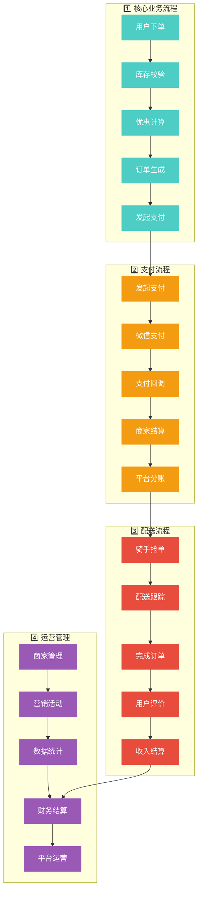
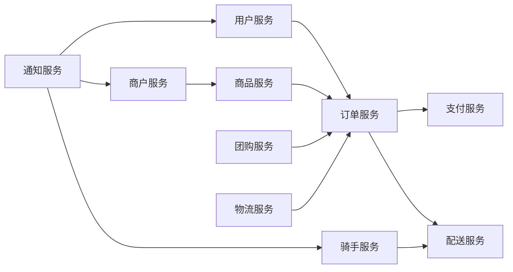
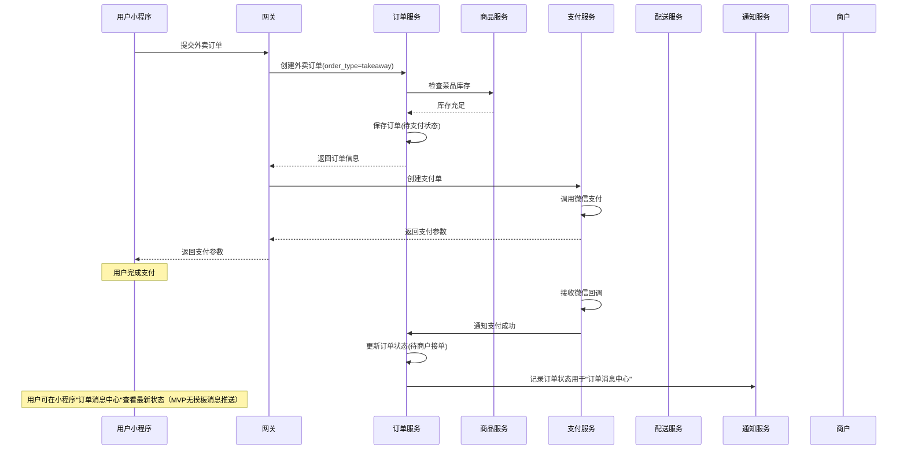
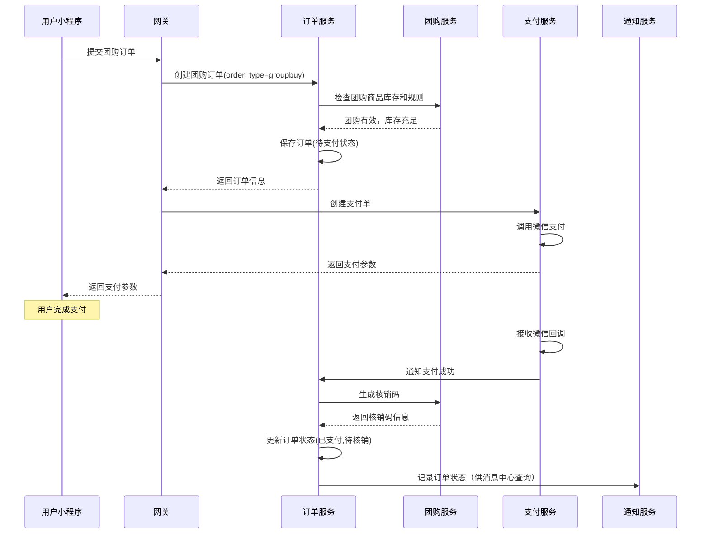
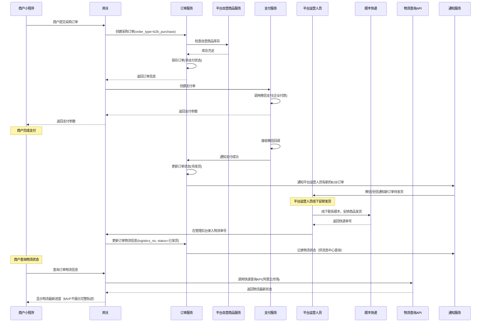
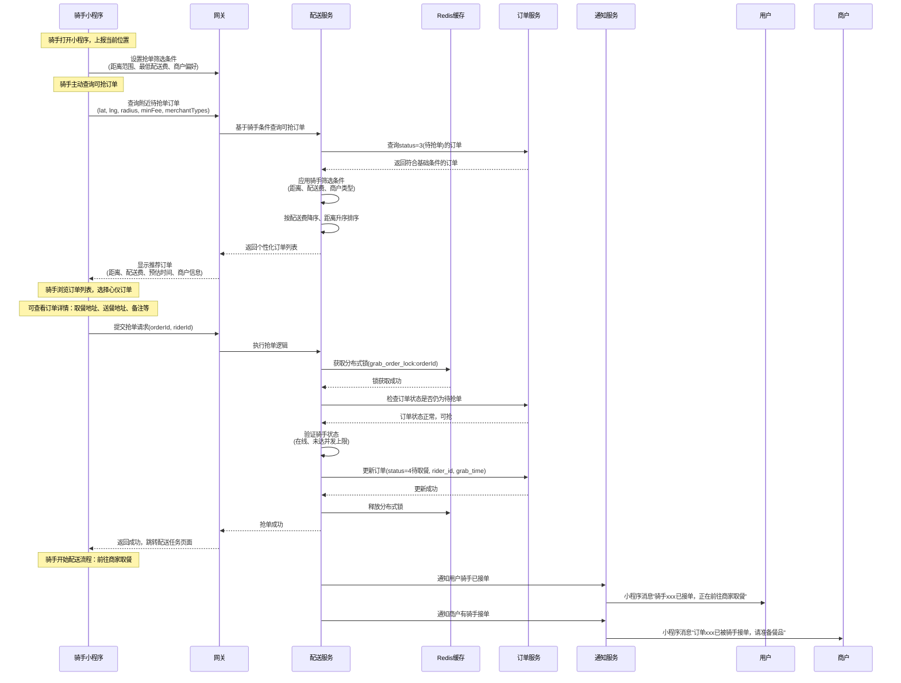
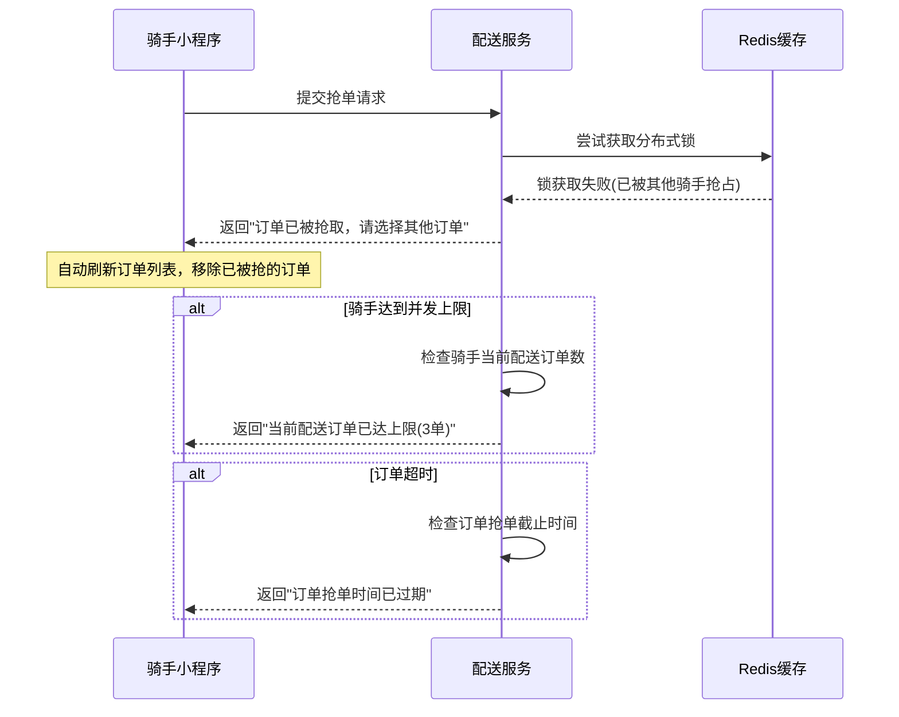

# 贡享臻选2.0外卖系统技术方案 - MVP版本

## 1. 项目目标与范围

### 业务目标
实现一个**微信小程序端**的外卖平台MVP，支持用户点餐、商户接单、骑手抢单配送、支付结算的完整闭环。

### MVP功能边界
✅ **包含功能**：
- 用户注册登录、地址管理
- 商户入驻、商品管理
- 下单支付（微信支付）
- 骑手抢单配送
- 基础收入结算
- 订单状态追踪

❌ **暂不包含**：
- 发布灰度、容灾备份
- 安全合规、监控运维  
- 营销活动、团购电商
- 复杂的数据分析和报表

### 容量目标
- 日订单量：1000-5000单
- 并发用户：100-500人
- 响应时间：<2s
- 可用性：99%+

## 2. 技术架构设计

### 2.1 整体架构图

#### 系统架构全景图

```mermaid
graph TB
    %% 接入层
    subgraph "🔗 接入层 (API Gateway)"
        Gateway["gxz-gateway<br/>统一网关/路由/鉴权"]
    end

    %% 终端层 
    subgraph "📱 终端应用"
        UserApp["用户小程序<br/>点餐/团购/评价"]
        RiderApp["骑手小程序<br/>抢单/配送/收入"]
        MerchantApp["商户小程序<br/>接单/管理/采购"]
        AdminWeb["运营后台<br/>数据/审核/配置"]
    end

    %% 业务服务层
    subgraph "📊 业务服务层 (Business Services)"
        subgraph "用户域"
            UserSvc["gxz-user<br/>用户管理<br/>注册/资料/地址"]
        end
        
        subgraph "商户域"
            MerchantSvc["gxz-merchant<br/>商户管理<br/>入驻/营业/店铺"]
            GoodsSvc["gxz-goods<br/>商品管理<br/>菜品/库存/规格"]
        end
        
        subgraph "交易域"
            OrderSvc["gxz-order<br/>订单管理<br/>外卖/团购/采购"]
            PaymentSvc["gxz-payment<br/>支付服务<br/>微信支付/退款"]
        end
        
        subgraph "履约域"
            DeliverySvc["gxz-delivery<br/>配送服务<br/>抢单/配送/追踪"]
        end
        
        subgraph "支撑域"
            PromotionSvc["gxz-promotion<br/>营销服务<br/>优惠券/活动"]
            ContentSvc["gxz-content<br/>内容服务<br/>团购/公告/CMS"]
            WalletSvc["gxz-wallet<br/>钱包服务<br/>余额/提现"]
            SettlementSvc["gxz-settlement<br/>结算服务<br/>分账/对账"]
            AdminSvc["gxz-admin<br/>管理服务<br/>后台/权限/配置"]
        end
    end

    %% 公共服务层
    subgraph "🔧 公共服务层 (Common Services)"
        CommonSvc["gxz-common<br/>通用服务<br/>消息/文件/工具类"]
    end

    %% 基础设施层
    subgraph "🏗️ 基础设施层 (Infrastructure)"
        subgraph "数据存储"
            MySQL["MySQL<br/>业务数据库"]
            Redis["Redis<br/>缓存/会话"]
        end
        
        subgraph "消息中间件"
            RabbitMQ["RabbitMQ<br/>异步消息"]
        end
        
        subgraph "注册中心"
            Nacos["Nacos<br/>服务发现/配置中心"]
        end
        
        subgraph "第三方服务"
            WechatPay["微信支付"]
            TencentMap["腾讯地图"]
            ExpressAPI["快递查询API"]
        end
    end

    %% 连接关系
    UserApp --> Gateway
    RiderApp --> Gateway
    MerchantApp --> Gateway
    AdminWeb --> Gateway

    Gateway --> UserSvc
    Gateway --> MerchantSvc
    Gateway --> GoodsSvc
    Gateway --> OrderSvc
    Gateway --> PaymentSvc
    Gateway --> DeliverySvc
    Gateway --> PromotionSvc
    Gateway --> ContentSvc
    Gateway --> WalletSvc
    Gateway --> SettlementSvc
    Gateway --> AdminSvc

    UserSvc --> CommonSvc
    MerchantSvc --> CommonSvc
    GoodsSvc --> CommonSvc
    OrderSvc --> CommonSvc
    PaymentSvc --> CommonSvc
    DeliverySvc --> CommonSvc
    PromotionSvc --> CommonSvc
    ContentSvc --> CommonSvc
    WalletSvc --> CommonSvc
    SettlementSvc --> CommonSvc
    AdminSvc --> CommonSvc

    UserSvc --> MySQL
    MerchantSvc --> MySQL
    GoodsSvc --> MySQL
    OrderSvc --> MySQL
    PaymentSvc --> MySQL
    DeliverySvc --> MySQL
    PromotionSvc --> MySQL
    ContentSvc --> MySQL
    WalletSvc --> MySQL
    SettlementSvc --> MySQL
    AdminSvc --> MySQL

    UserSvc --> Redis
    OrderSvc --> Redis
    DeliverySvc --> Redis
    PaymentSvc --> Redis

    OrderSvc --> RabbitMQ
    PaymentSvc --> RabbitMQ
    DeliverySvc --> RabbitMQ

    PaymentSvc --> WechatPay
    DeliverySvc --> TencentMap
    SettlementSvc --> ExpressAPI

    %% 样式定义
    classDef gateway fill:#ff6b6b,stroke:#ff6b6b,stroke-width:2px,color:#fff
    classDef userDomain fill:#4ecdc4,stroke:#4ecdc4,stroke-width:2px,color:#fff
    classDef merchantDomain fill:#45b7d1,stroke:#45b7d1,stroke-width:2px,color:#fff  
    classDef tradeDomain fill:#f39c12,stroke:#f39c12,stroke-width:2px,color:#fff
    classDef fulfillmentDomain fill:#e74c3c,stroke:#e74c3c,stroke-width:2px,color:#fff
    classDef supportDomain fill:#9b59b6,stroke:#9b59b6,stroke-width:2px,color:#fff
    classDef common fill:#2ecc71,stroke:#2ecc71,stroke-width:2px,color:#fff
    classDef infrastructure fill:#34495e,stroke:#34495e,stroke-width:2px,color:#fff
    classDef external fill:#e67e22,stroke:#e67e22,stroke-width:2px,color:#fff

    class Gateway gateway
    class UserSvc userDomain
    class MerchantSvc,GoodsSvc merchantDomain
    class OrderSvc,PaymentSvc tradeDomain
    class DeliverySvc fulfillmentDomain
    class PromotionSvc,ContentSvc,WalletSvc,SettlementSvc,AdminSvc supportDomain
    class CommonSvc common
    class MySQL,Redis,RabbitMQ,Nacos infrastructure
    class WechatPay,TencentMap,ExpressAPI external
```



#### 核心业务流程图



#### 架构特点说明

**🎯 分层架构设计**
- **接入层**：统一网关，提供路由、鉴权、限流、日志等横切关注点
- **业务服务层**：按DDD领域驱动设计，划分为5个业务域的微服务
- **公共服务层**：提供通用的技术能力，避免重复建设
- **基础设施层**：数据存储、消息队列、注册中心等基础组件

**🔄 服务间依赖关系**
- 所有外部请求统一经过网关层，网关负责路由分发
- 各业务服务通过公共服务层复用通用能力
- 服务间通过Nacos进行服务发现，支持负载均衡
- 异步处理通过RabbitMQ实现解耦

### 2.2 技术选型

| 组件类型 | 技术选型 | 版本 | 说明 |
|---------|---------|------|------|
| **前端技术** | | | |
| 用户端 | 微信小程序 | 最新版 | 点餐、团购、评价功能 |
| 骑手端 | 微信小程序 | 最新版 | 抢单、配送、收入管理 |
| 商户端 | 微信小程序 | 最新版 | 接单、管理、采购功能 |
| 管理端 | Vue3 + Element Plus | 3.x | 运营后台管理系统 |
| **后端架构** | | | |
| API网关 | Spring Cloud Gateway | 3.1.x | 统一入口、鉴权、限流、路由 |
| 微服务框架 | Spring Boot | 2.7.x | 快速开发，成熟稳定 |
| 微服务治理 | Spring Cloud Alibaba | 2021.0.x | 服务注册发现、配置管理 |
| 服务调用 | OpenFeign + LoadBalancer | 3.1.x | HTTP/REST调用，负载均衡 |
| **中间件组件** | | | |
| 服务注册 | Nacos Discovery | 2.2.x | 服务发现、健康检查 |
| 配置中心 | Nacos Config | 2.2.x | 统一配置管理，动态刷新 |
| 数据库 | MySQL | 8.0.x | 业务数据存储，主从部署 |
| 缓存 | Redis | 7.0.x | 会话缓存、热点数据 |
| 消息队列 | RabbitMQ | 3.11.x | 异步处理、事件驱动 |
| 分布式锁 | Redisson | 3.17.x | 抢单防重、分布式锁 |
| **第三方服务** | | | |
| 支付 | 微信支付 | V3 API | 小程序支付、企业付款 |
| 地图服务 | 腾讯地图API | 最新版 | 位置服务、距离计算 |
| 物流查询 | 快递鸟API | 最新版 | 采购订单物流追踪 |
| **开发工具** | | | |
| 数据访问 | MyBatis Plus | 3.5.x | ORM框架，代码生成 |
| API文档 | Swagger/OpenAPI | 3.0.x | 接口文档自动生成 |
| 日志框架 | Logback + SLF4J | 1.2.x | 日志记录、链路追踪 |
| 数据校验 | Spring Validation | 2.7.x | 参数校验、数据验证 |
| **部署运维** | | | |
| 容器化 | Docker | 20.x | 应用容器化部署 |
| 反向代理 | Nginx | 1.22.x | 负载均衡、静态资源 |
| 进程管理 | Supervisor | 4.x | 进程守护、自动重启 |

#### 2.3 服务间调用与注册发现（采用 Nacos）
- 注册发现：全量采用 `Nacos` 作为注册中心与配置中心；所有服务启动时自动注册到 Nacos。
- 调用方式：
  - 外部/前端 → 统一通过 `API网关`（Spring Cloud Gateway）
  - 服务间 → 使用 `OpenFeign + Spring Cloud LoadBalancer` 按“服务名”调用并负载均衡
- 配置管理：使用 `Nacos Config` 做统一配置，按`命名空间/分组/数据ID`区分环境与服务。
- 限流熔断：结合 `Sentinel`（可选）对关键接口进行保护。

示例（网关路由按服务名）：
```yaml
spring:
  cloud:
    gateway:
      discovery:
        locator:
          enabled: true     # 允许按服务名自动路由
      routes:
        - id: order
          uri: lb://siam-order-service
          predicates:
            - Path=/order/**
```

示例（Feign 按服务名调用）：
```java
@FeignClient(name = "siam-order-service")
public interface OrderClient {
  @GetMapping("/api/order/{id}")
  OrderDTO get(@PathVariable Long id);
}
```

示例（Nacos 配置）:
```yaml
spring:
  cloud:
    nacos:
      discovery:
        server-addr: ${NACOS_ADDR:127.0.0.1:8848}
        namespace: ${NACOS_NS:prod}
      config:
        server-addr: ${NACOS_ADDR:127.0.0.1:8848}
        namespace: ${NACOS_NS:prod}
        group: SIAM
        file-extension: yaml
```

## 3. 核心服务设计

### 3.1 服务拆分原则

按照DDD领域驱动设计思想，将系统拆分为5个业务域，每个域包含相关的微服务：

| 业务域 | 服务名称 | 端口 | 核心职责 | 主要功能 |
|--------|----------|------|----------|----------|
| **🔗 接入层** | `gxz-gateway` | 8080 | 统一网关 | • 路由分发<br/>• 身份鉴权<br/>• 限流熔断<br/>• 日志记录 |
| **👤 用户域** | `gxz-user` | 8081 | C端用户管理 | • 微信注册登录<br/>• 用户资料管理<br/>• 收货地址管理<br/>• 账户信息维护 |
| **🏪 商户域** | `gxz-merchant` | 8082 | B端商户管理 | • 商户入驻审核<br/>• 店铺信息管理<br/>• 营业状态设置<br/>• 商户权限控制 |
| | `gxz-goods` | 8083 | 商品信息管理 | • 外卖菜品管理<br/>• 平台自营商品<br/>• 团购商品设置<br/>• 库存规格管理 |
| **💰 交易域** | `gxz-order` | 8084 | 订单全生命周期 | • 外卖/团购/采购订单<br/>• 订单状态机管理<br/>• 订单查询统计<br/>• 取消退款处理 |
| | `gxz-payment` | 8085 | 支付结算 | • 微信支付集成<br/>• 支付回调处理<br/>• 企业付款(采购订单)<br/>• 退款对账 |
| **🚚 履约域** | `gxz-delivery` | 8086 | 配送履约 | • 订单抢单逻辑<br/>• 配送状态追踪<br/>• 骑手位置上报<br/>• 配送费计算 |
| **🎯 支撑域** | `gxz-promotion` | 8087 | 营销服务 | • 平台/店铺优惠券配置<br/>• 发放/领取<br/>• 下单校验与核销<br/>• 满减活动管理 |
| | `gxz-content` | 8088 | 内容服务 | • 团购商品发布<br/>• 核销码生成<br/>• 核销验证<br/>• CMS内容管理 |
| | `gxz-wallet` | 8089 | 钱包服务 | • 账户余额管理<br/>• 充值/提现<br/>• 交易流水<br/>• 资金冻结解冻 |
| | `gxz-settlement` | 8090 | 结算服务 | • 商户分账结算<br/>• 骑手收入结算<br/>• 平台抽佣计算<br/>• 对账报表 |
| | `gxz-admin` | 8091 | 管理服务 | • 运营后台<br/>• 权限管理<br/>• 系统配置<br/>• 数据统计 |
| **🔧 公共层** | `gxz-common` | - | 通用服务 | • 消息通知<br/>• 文件上传<br/>• 工具类库<br/>• 通用组件 |

### 服务间依赖关系



### 3.2 功能需求与业务域映射

根据贡享臻选2.0的功能结构图，详细说明每个功能需求在5个业务域中的归属：

#### 3.2.1 C端（用户端）功能映射（对齐美团，区分外卖与团购）

- 外卖与团购的用户路径完全不同，需分别设计。

##### A) 外卖（Takeaway）
| 功能模块 | 具体功能 | 负责业务域 | 负责服务 | 说明 |
|----------|----------|------------|----------|------|
| 首页/发现 | 附近商家列表、搜索、分类筛选 | 商户域 | 商品服务 | 展示可配送商家与菜品入口 |
| 商家详情 | 菜品列表、规格选择、门店信息、配送费展示 | 商户域 | 商品服务 | 支持规格与加购 |
| 购物车 | 加入购物车/修改数量/备注 | 交易域 | 订单服务 | 本地缓存+服务端校验 |
| 优惠券 | 选择可用优惠券 | 支撑域 | 营销服务 | 展示/选择可用平台券或店铺券 |
| 下单与支付 | 创建外卖订单、选择地址、计算配送费、微信支付 | 交易域 | 订单+支付服务 | 订单生成、价格校验、支付下单（结合`/api/promo/calc`与锁券） |
| 订单跟踪 | 最新位置与状态（待接单/待抢单/待取餐/配送中/已完成） | 交易域/履约域 | 订单/配送服务 | 轮询查询最新位置（MVP不展示地图轨迹） |
| 评价与售后 | 评价商家与骑手、退单/退款申请 | 履约域/交易域 | 骑手/订单服务 | 评价归属骑手与商家，售后走订单服务 |

##### B) 团购（GroupBuy）
| 功能模块 | 具体功能 | 负责业务域 | 负责服务 | 说明 |
|----------|----------|------------|----------|------|
| 团购列表 | 团购活动浏览、搜索、分类 | 支撑域 | 团购服务 | 展示在售团购活动 |
| 团购详情 | 套餐内容、有效期、使用规则、门店信息 | 支撑域 | 团购服务 | 展示核销规则与有效期 |
| 优惠券 | 选择可用优惠券（若支持） | 支撑域 | 营销服务 | MVP可先不支持团购券，预留展示入口 |
| 下单与支付 | 创建团购订单、微信支付 | 交易域 | 订单+支付服务 | 价格校验、生成订单（可接入`/api/promo/calc`） |
| 核销码 | 生成核销码、查看核销码 | 支撑域 | 团购服务 | 支付成功后生成一码多用/一次性码（按规则） |
| 使用记录 | 查看已使用/未使用、退款申请 | 支撑域/交易域 | 团购/订单服务 | 团购退款独立于外卖售后 |

#### 3.2.2 骑手端功能映射

| 功能模块 | 具体功能 | 负责业务域 | 负责服务 | 说明 |
|----------|----------|------------|----------|------|
| **抢单配送** | 附近订单查询 | 履约域 | 配送服务 | 基于位置查询待抢订单 |
| | 订单抢单 | 履约域 | 配送服务 | 分布式锁抢单逻辑 |
| | 配送状态管理 | 履约域 | 配送服务 | 订单状态流转（取餐→配送→完成） |
| | 位置上报 | 履约域 | 配送服务 | 实时位置同步 |
| **个人中心** | 骑手信息 | 履约域 | 骑手服务 | 个人资料、认证状态 |
| | 收入明细 | 履约域 | 骑手服务 | 配送费收入、结算记录 |
| | 服务评级 | 履约域 | 骑手服务 | 服务能力评估、评价管理 |

#### 3.2.3 商户端功能映射

**商户端权限原则**：商户只管理自己作为**卖家**时的商品和订单，不处理作为**买家**时的业务。

| 功能模块 | 具体功能 | 负责业务域 | 负责服务 | 说明 |
|----------|----------|------------|----------|------|
| **🛒 采购功能（商户作为买家）** | 商品商城首页 | 商户域 | 商品服务 | 浏览平台自营商品 |
| | 商品详情页 | 商户域 | 商品服务 | 查看自营商品详情、规格 |
| | 加入购物车 | 交易域 | 订单服务 | 采购商品购物车 |
| | 采购下单与支付 | 交易域 | 订单服务+支付服务 | 创建采购订单、企业付款 |
| | 采购订单查询 | 交易域 | 订单服务 | 查看采购订单状态 |
| | 物流信息查询 | 支撑域 | 物流服务 | 查询采购商品快递状态 |
| **🍜 外卖管理（商户作为卖家）** | 外卖订单管理 | 交易域 | 订单服务 | 接单/拒单/备餐状态更新 |
| | 外卖商品管理 | 商户域 | 商品服务 | 菜品上架、规格、价格设置 |
| **🎁 团购管理（商户作为卖家）** | 团购商品发布/管理 | 支撑域 | 团购服务 | 团购活动创建、管理 |
| | 团购订单管理 | 支撑域 | 团购服务 | 查看团购订单、核销记录 |
| | 使用门槛设置 | 支撑域 | 团购服务 | 团购规则配置 |
| | 核销记录查看 | 支撑域 | 团购服务 | 核销码使用记录 |
| **🧧 优惠券管理（商户）** | 店铺优惠券配置 | 支撑域 | 营销服务 | 创建店铺券（满减/无门槛）、有效期、适用范围 |
| | 发放与核销统计 | 支撑域 | 营销服务 | 查看发放与使用情况 |
| **🏪 店铺管理** | 门店资料编辑 | 商户域 | 商户服务 | 店铺基本信息维护 |
| | 营业时间设置 | 商户域 | 商户服务 | 营业时间配置 |
| | 营业状态切换 | 商户域 | 商户服务 | 开店/打烊状态管理 |
| | 门店公告发布 | 商户域 | 商户服务 | 店铺公告管理 |
| **💰 财务管理（卖家收入）** | 外卖收入流水 | 交易域 | 订单服务 | 外卖订单收入明细 |
| | 团购收入流水 | 交易域 | 订单服务 | 团购订单收入明细 |
| | 结算明细 | 交易域 | 支付服务 | 资金结算记录 |
| | 提现申请 | 交易域 | 支付服务 | 商户提现功能 |
| **🛠 售后处理（卖家订单）** | 外卖售后管理 | 交易域 | 订单服务 | 处理外卖退单/退款申请 |
| | 团购售后管理 | 交易域 | 订单服务 | 处理团购退款申请 |

#### 3.2.4 管理后台功能映射

| 功能模块 | 具体功能 | 负责业务域 | 负责服务 | 说明 |
|----------|----------|------------|----------|------|
| **用户管理** | 用户信息管理 | 用户域 | 用户服务 | C端用户信息维护 |
| **商户管理** | 商户入驻审核 | 商户域 | 商户服务 | 商户资质审核 |
| | 商户信息管理 | 商户域 | 商户服务 | 商户基本信息维护 |
| **商品管理** | 自营商品管理 | 商户域 | 商品服务 | 平台自营商品维护 |
| | 商品审核 | 商户域 | 商品服务 | 商户上架商品审核 |
| **订单管理** | 订单统计查询 | 交易域 | 订单服务 | 全平台订单数据统计 |
| | 采购订单管理（打包发货） | 交易域 | 订单服务 | 平台作为卖家，处理商户采购订单 |
| | 物流单号录入 | 支撑域 | 物流服务 | 采购订单发货后录入快递单号 |
| **营销管理** | 团购活动审核 | 支撑域 | 团购服务 | 团购活动审核管理 |
| | 平台优惠券配置 | 支撑域 | 营销服务 | 创建平台券、发放策略、人群圈选 |
| | 商户优惠活动审核（可选） | 支撑域 | 营销服务 | 审核商户提交的店铺券/活动 |
| | 优惠活动配置 | 交易域 | 订单服务 | 平台优惠活动设置 |
| **系统配置** | 系统参数配置 | 支撑域 | 通知服务 | 系统基础配置管理 |
| | 消息模板管理 | 支撑域 | 通知服务 | 微信消息模板配置 |

#### 3.2.5 业务域职责总结

| 业务域 | 核心职责范围 | 主要端点支持 |
|--------|--------------|--------------|
| **用户域** | C端用户的注册登录、资料管理、地址管理 | C端（用户端） |
| **商户域** | B端商户管理、所有商品管理（外卖菜品+自营商品+团购商品） | 商户端、管理后台 |
| **交易域** | 所有类型订单（外卖+团购+采购）、支付结算、售后处理 | 所有端点 |
| **履约域** | 外卖订单的骑手抢单配送、骑手管理、评价体系 | 骑手端、C端（评价） |
| **支撑域** | 消息通知、团购业务、采购订单物流查询 | 所有端点（辅助功能） |

#### 3.2.6 业务角色关系说明

不同业务场景中，商户和平台扮演不同的买卖角色：

| 业务场景 | 买家 | 卖家 | 商户端功能 | 平台管理功能 |
|----------|------|------|------------|--------------|
| **外卖订单** | 用户 | 商户 | 接单、拒单、备餐状态更新 | 订单监控、数据统计 |
| **团购订单** | 用户 | 平台+商户 | 发布团购、设置规则、核销 | 团购审核、规则管理 |
| **采购订单** | 商户 | 平台 | 下单、支付、查询物流 | 订单处理、打包发货、录入快递单号 |

**🎯 关键理解**：
- 商户在**外卖场景**是卖家 → 有订单处理权限
- 商户在**采购场景**是买家 → 只能查询不能发货
- 平台在**采购场景**是卖家 → 负责发货和物流管理

### 3.3 核心服务职责

#### 用户服务 (User Service)
- **职责**：用户注册登录、资料管理、地址管理
- **核心API**：
  - `POST /api/user/register` - 用户注册
  - `POST /api/user/login` - 微信登录
  - `GET /api/user/profile` - 获取用户信息
  - `POST /api/user/address` - 新增地址

#### 商户服务 (Merchant Service)
- **职责**：商户入驻、店铺管理、营业设置
- **核心API**：
  - `POST /api/merchant/register` - 商户入驻
  - `GET /api/merchant/info` - 店铺信息
  - `PUT /api/merchant/status` - 营业状态切换

#### 商品服务 (Product Service)  
- **职责**：商品管理、库存管理、分类规格（支持外卖菜品和平台自营商品）
- **核心API**：
  - `POST /api/product/create` - 创建商品（外卖菜品/平台自营商品）
  - `GET /api/product/merchant-list` - 商户菜品列表
  - `GET /api/product/platform-list` - 平台自营商品列表  
  - `PUT /api/product/stock` - 更新库存

#### 订单服务 (Order Service)
- **职责**：订单创建、状态管理、查询取消
- **核心API**：
  - `POST /api/order/create` - 创建订单
  - `GET /api/order/detail` - 订单详情
  - `PUT /api/order/cancel` - 取消订单

#### 支付服务 (Payment Service)
- **职责**：微信支付集成、回调处理、退款
- **核心API**：
  - `POST /api/payment/create` - 创建支付单
  - `POST /api/payment/callback` - 支付回调
  - `POST /api/payment/refund` - 申请退款

#### 骑手服务 (Rider Service)
- **职责**：骑手注册认证、收入管理、评价
- **核心API**：
  - `POST /api/rider/register` - 骑手注册
  - `GET /api/rider/profile` - 骑手信息
  - `GET /api/rider/earnings` - 收入统计

#### 配送服务 (Delivery Service)
- **职责**：订单抢单、配送状态、位置追踪
- **核心API**：
  - `GET /api/delivery/nearby-orders` - 附近订单
  - `POST /api/delivery/grab-order` - 抢单
  - `PUT /api/delivery/update-status` - 更新配送状态

#### 通知服务 (Notification Service)
- **职责**：订单状态查询页面数据提供（MVP仅在小程序内查看，不做外部推送）
- **核心API**：
  - `GET /api/notify/order-status/{orderNo}` - 查询订单当前状态与时间轴
  - `GET /api/notify/order-timeline/{orderNo}` - 查询订单状态变更记录

> 说明：MVP阶段不做微信模板消息/短信推送，仅在小程序内提供"订单消息中心"页面轮询查看状态；后续可无缝升级为模板消息推送。

#### 团购服务 (GroupBuy Service) 
- **职责**：团购商品管理、核销码生成、团购规则
- **核心API**：
  - `POST /api/groupbuy/create` - 创建团购商品
  - `POST /api/groupbuy/generate-voucher` - 生成核销码
  - `POST /api/groupbuy/verify-voucher` - 核销验证

#### 物流服务 (Logistics Service)
- **职责**：采购订单物流单号管理、快递查询API集成、物流最新状态查询（MVP不做完整轨迹）
- **核心API**：
  - `PUT /api/logistics/update-order-tracking` - 录入物流单号(管理后台)
  - `GET /api/logistics/query-tracking` - 查询物流最新状态(对接阿里云快递查询API)
  - `GET /api/logistics/track-detail` - 预留接口，后续支持轨迹

#### 评价与审核 (Review Service - 简化并归属交易域)
- **职责**：订单评价管理（商家评分/骑手评分分开）、商家审核决定是否展示
- **规则**：
  - 用户完成订单后可分别对商家与骑手打分与评价
  - 评价默认状态为`pending`（待审核），仅商家后台可查看并进行“通过/隐藏”处理
  - 通过后评价对其他用户展示；隐藏则仅平台可见用于风控
- **核心API**：
  - `POST /api/review/submit` - 提交评价（参数：orderId、merchantScore、merchantComment、riderScore、riderComment、images[]）
  - `GET /api/review/list-by-merchant` - 商家后台查询店铺所有评价（含待审核）
  - `PUT /api/review/moderate` - 商家审核评价（approve=通过展示 / reject=隐藏）
  - `GET /api/review/public-list` - 前台展示已通过评价
- **数据模型（MVP建议）**：
  - 表`tb_review`：`id, order_id, merchant_id, rider_id, user_id, merchant_score, merchant_comment, rider_score, rider_comment, images(json), status(pending|approved|hidden), created_time, updated_time`
  - 表`tb_review_audit_log`：`id, review_id, auditor_id(商户管理员), action(approve|reject), remark, created_time`

#### 营销服务 (Promotion Service)
- **职责**：优惠券（MVP聚焦）与基础满减规则（预留）
- **优惠券模型（MVP）**：
  - 类型：满减券（满X减Y）、无门槛券（减Y）
  - 维度：平台券/店铺券
  - 约束：有效期、适用商品/分类、每人限领次数
  - 状态：未开始/进行中/已结束/已失效
- **核心API**：
  - `POST /api/promo/coupon/create` - 创建优惠券（平台/店铺）
  - `POST /api/promo/coupon/issue` - 发放优惠券（按人群/手动发放）
  - `GET /api/promo/coupon/my` - 我的优惠券列表（未使用/已使用/已过期）
  - `POST /api/promo/coupon/lock` - 下单前锁定优惠券（防并发）
  - `POST /api/promo/coupon/consume` - 支付成功后核销优惠券
  - `POST /api/promo/calc` - 下单价格计算（返回可用优惠券与应付金额）

> 说明：MVP仅实现优惠券；满减/限时活动等统一走订单价计算预留接口`/api/promo/calc`，后续扩展不影响下单流程。

## 4. 关键业务流程

### 4.1 用户外卖下单流程



### 4.2 用户团购下单流程



### 4.3 商户采购订单流程



### 4.4 骑手主动抢单流程

#### 业务逻辑说明
骑手在小程序上**主动查询**待分配订单，根据自己的条件（位置、配送费、距离等）选择合适的订单进行抢单，而非系统自动分配。

#### 抢单条件筛选
骑手可以根据以下条件筛选订单：
- **距离范围**：3-5公里内的订单
- **配送费高低**：优先显示配送费较高的订单  
- **商户类型**：熟悉的商户优先
- **订单时效**：避免超时订单
- **路线顺路**：与当前位置或其他订单顺路



#### 抢单失败处理


## 5. 数据库设计 (MVP单库架构)

### 5.1 核心数据表

#### 用户相关表
```sql
-- 用户表
CREATE TABLE `tb_user` (
    `id` int NOT NULL AUTO_INCREMENT,
    `openid` varchar(50) NOT NULL COMMENT '微信openid',
    `phone` varchar(20) DEFAULT NULL COMMENT '手机号',
    `nickname` varchar(50) DEFAULT NULL COMMENT '昵称',
    `avatar` varchar(200) DEFAULT NULL COMMENT '头像',
    `status` tinyint DEFAULT 1 COMMENT '状态：1=正常',
    `created_time` datetime NOT NULL,
    `updated_time` datetime NOT NULL,
    PRIMARY KEY (`id`),
    UNIQUE KEY `uk_openid` (`openid`)
) ENGINE=InnoDB DEFAULT CHARSET=utf8mb4 COMMENT='用户表';

-- 用户地址表
CREATE TABLE `tb_user_address` (
    `id` int NOT NULL AUTO_INCREMENT,
    `user_id` int NOT NULL COMMENT '用户ID',
    `name` varchar(50) NOT NULL COMMENT '收货人姓名',
    `phone` varchar(20) NOT NULL COMMENT '联系电话',
    `province` varchar(20) NOT NULL COMMENT '省份',
    `city` varchar(20) NOT NULL COMMENT '城市',
    `area` varchar(20) NOT NULL COMMENT '区县',
    `street` varchar(100) NOT NULL COMMENT '详细地址',
    `longitude` decimal(10,7) NOT NULL COMMENT '经度',
    `latitude` decimal(10,7) NOT NULL COMMENT '纬度',
    `is_default` tinyint DEFAULT 0 COMMENT '是否默认',
    `created_time` datetime NOT NULL,
    PRIMARY KEY (`id`),
    KEY `idx_user_id` (`user_id`)
) ENGINE=InnoDB DEFAULT CHARSET=utf8mb4 COMMENT='用户地址表';
```

#### 商户商品表
```sql
-- 商户表
CREATE TABLE `tb_merchant` (
    `id` int NOT NULL AUTO_INCREMENT,
    `name` varchar(100) NOT NULL COMMENT '商户名称',
    `phone` varchar(20) NOT NULL COMMENT '联系电话',
    `address` varchar(200) NOT NULL COMMENT '商户地址',
    `longitude` decimal(10,7) NOT NULL COMMENT '经度',
    `latitude` decimal(10,7) NOT NULL COMMENT '纬度',
    `status` tinyint DEFAULT 1 COMMENT '状态：1=营业中，2=休息中',
    `created_time` datetime NOT NULL,
    PRIMARY KEY (`id`)
) ENGINE=InnoDB DEFAULT CHARSET=utf8mb4 COMMENT='商户表';

-- 商品表（支持外卖菜品和平台自营商品）
CREATE TABLE `tb_product` (
    `id` int NOT NULL AUTO_INCREMENT,
    `product_type` tinyint NOT NULL COMMENT '商品类型：1=外卖菜品，2=平台自营商品，3=团购商品',
    `merchant_id` int DEFAULT NULL COMMENT '商户ID（外卖菜品）',
    `platform_category_id` int DEFAULT NULL COMMENT '平台商品分类ID（自营商品）',
    `name` varchar(100) NOT NULL COMMENT '商品名称',
    `price` decimal(8,2) NOT NULL COMMENT '价格',
    `stock` int DEFAULT 999 COMMENT '库存',
    `image_url` varchar(200) DEFAULT NULL COMMENT '商品图片',
    `description` text COMMENT '商品描述',
    `specifications` json DEFAULT NULL COMMENT '商品规格（JSON）',
    `status` tinyint DEFAULT 1 COMMENT '状态：1=上架，2=下架',
    `min_order_qty` int DEFAULT 1 COMMENT '起订量（B2B商品）',
    `unit` varchar(20) DEFAULT '份' COMMENT '单位',
    `created_time` datetime NOT NULL,
    `updated_time` datetime NOT NULL,
    PRIMARY KEY (`id`),
    KEY `idx_merchant_id` (`merchant_id`),
    KEY `idx_product_type_status` (`product_type`, `status`),
    KEY `idx_platform_category` (`platform_category_id`)
) ENGINE=InnoDB DEFAULT CHARSET=utf8mb4 COMMENT='商品表（支持外卖菜品和平台自营商品）';
```

#### 订单相关表
```sql
-- 订单表（统一外卖、团购、采购订单）
CREATE TABLE `tb_order` (
    `id` int NOT NULL AUTO_INCREMENT,
    `order_no` varchar(50) NOT NULL COMMENT '订单号',
    `order_type` varchar(20) NOT NULL COMMENT '订单类型：takeaway=外卖，groupbuy=团购，purchase=采购订单',
    `buyer_id` int NOT NULL COMMENT '买方ID（用户ID或商户ID）',
    `buyer_type` tinyint NOT NULL COMMENT '买方类型：1=用户，2=商户',
    `seller_id` int DEFAULT NULL COMMENT '卖方ID（商户ID或平台）',
    `total_amount` decimal(8,2) NOT NULL COMMENT '订单总金额',
    `delivery_fee` decimal(8,2) DEFAULT 0.00 COMMENT '配送费',
    `actual_amount` decimal(8,2) NOT NULL COMMENT '实际支付金额',
    `status` tinyint NOT NULL COMMENT '订单状态：1=待支付，2=待商户接单，3=待抢单，4=待取餐，5=配送中，6=已完成，7=已取消（外卖）；对于团购：2=待核销，6=已完成；对于采购订单：2=待发货，3=已发货，4=运输中，6=已完成',
    `delivery_address` text COMMENT '配送地址（外卖）',
    `delivery_longitude` decimal(10,7) COMMENT '配送经度',
    `