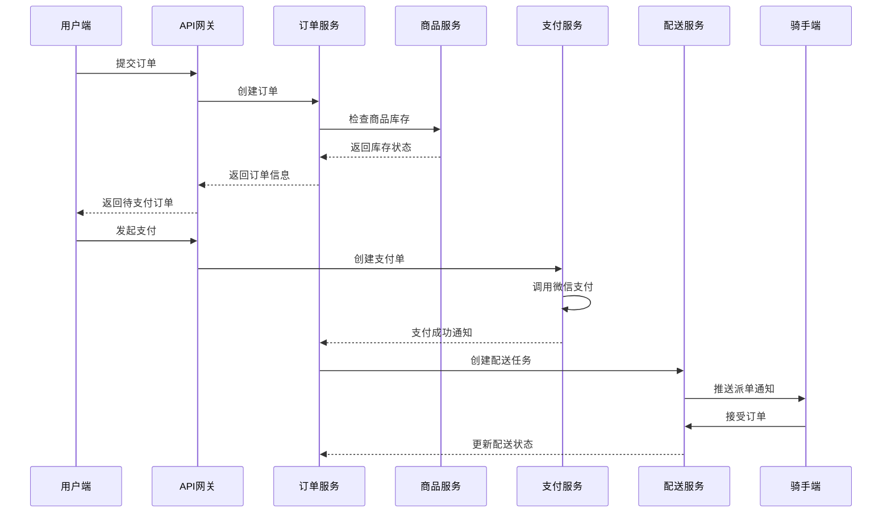
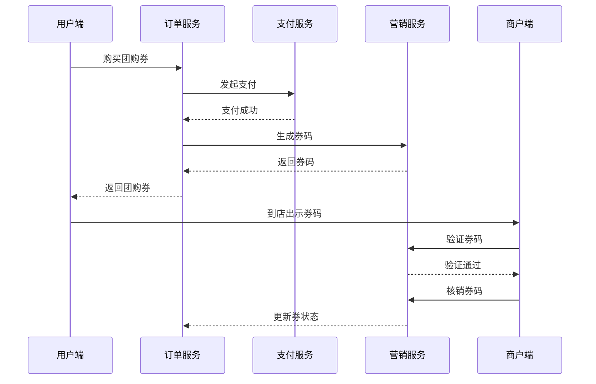
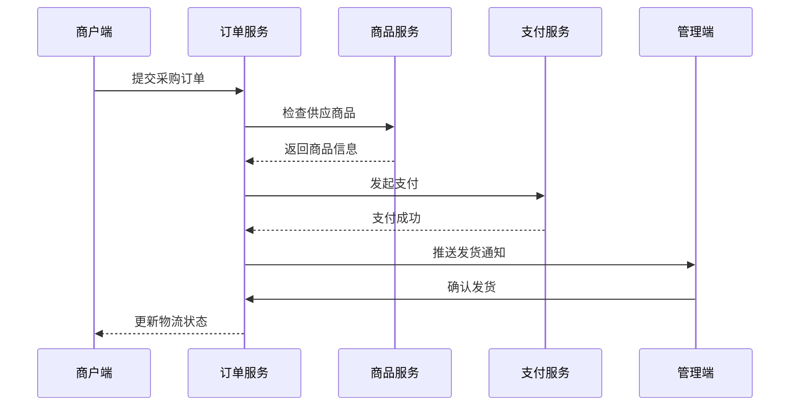

# 贡享臻选微服务架构设计方案

## 1. 项目概述

贡享臻选是一个综合性本地生活服务平台，服务于县城/小镇用户，提供外卖、团购、B2B采购等多元化业务。系统采用Spring Boot微服务架构，支持多端应用访问。

### 1.1 业务范围
- **外卖业务**: 餐饮商户入驻，用户下单，骑手配送
- **团购业务**: 优惠券团购，到店核销消费
- **B2B采购**: 商户采购平台商品，平台供应链服务
- **多端支持**: 用户APP、商户APP、骑手APP、管理后台

### 1.2 技术架构
- **架构模式**: 微服务架构 + API网关
- **服务发现**: Nacos
- **数据存储**: MySQL + Redis
- **通信协议**: HTTP/REST + RPC
- **部署方式**: Docker容器化部署

## 2. 微服务拆分架构

### 2.1 服务拆分原则
1. **业务域驱动**: 按核心业务领域拆分
2. **数据自治**: 每个服务管理自己的数据
3. **职责单一**: 单一服务专注单一业务职责
4. **松耦合**: 服务间通过接口通信，减少依赖

### 2.2 核心服务架构图

```
                    ┌─────────────────┐
                    │   API Gateway   │
                    │   (统一入口)     │
                    └─────────┬───────┘
                              │
               ┌──────────────┼──────────────┐
               │              │              │
    ┌─────────────┐  ┌─────────────┐  ┌─────────────┐
    │  用户服务    │  │  商户服务    │  │  骑手服务    │
    │ gxz-user    │  │gxz-merchant │  │ gxz-rider   │
    └─────────────┘  └─────────────┘  └─────────────┘
               │              │              │
               └──────────────┼──────────────┘
                              │
                   ┌─────────────┐
                   │   订单服务   │
                   │  gxz-order  │
                   │(外卖/团购/B2B)│
                   └─────┬───────┘
                         │
          ┌──────────────┼──────────────┐
          │              │              │
   ┌─────────────┐ ┌─────────────┐ ┌─────────────┐
   │  商品服务    │ │  支付服务    │ │  配送服务    │
   │ gxz-goods   │ │gxz-payment  │ │gxz-delivery │
   └─────────────┘ └─────────────┘ └─────────────┘
          │              │              │
          └──────────────┼──────────────┘
                         │
          ┌──────────────┼──────────────┐
          │              │              │
   ┌─────────────┐ ┌─────────────┐ ┌─────────────┐
   │  营销服务    │ │  结算服务    │ │  通知服务    │
   │gxz-promotion│ │gxz-settlement│ │gxz-message  │
   └─────────────┘ └─────────────┘ └─────────────┘
          │              │              │
          └──────────────┼──────────────┘
                         │
                   ┌─────────────┐
                   │  管理服务    │
                   │  gxz-admin  │
                   └─────────────┘
```

## 3. 服务详细设计

### 3.1 API网关服务 (gxz-gateway)
**服务职责:**
- 统一API入口，路由转发
- 认证授权，跨域处理
- 流量控制，监控日志

**部署信息:**
- 端口: 8080
- 负载均衡: Nginx

### 3.2 用户服务 (gxz-user)
**服务职责:**
- C端用户注册登录
- 用户信息管理
- 用户地址管理
- 用户积分体系

**核心数据模型:**
```sql
用户表 (t_user)
├── 用户基本信息 (user_id, phone, nickname, avatar)
├── 用户状态 (status, create_time, update_time)
└── 用户等级积分 (level, points)

地址表 (t_user_address)
├── 地址信息 (address_id, user_id, address, lat, lng)
└── 地址标签 (tag, is_default)
```

### 3.3 商户服务 (gxz-merchant)
**服务职责:**
- 商户入驻审核
- 商户信息管理
- 营业状态管理
- 配送范围设置

**核心数据模型:**
```sql
商户表 (t_merchant)
├── 商户基本信息 (merchant_id, name, contact, address)
├── 营业信息 (business_hours, delivery_range, status)
└── 认证信息 (license, audit_status)

商户分类表 (t_merchant_category)
├── 分类信息 (category_id, name, icon)
└── 分类层级 (parent_id, level, sort)
```

### 3.4 骑手服务 (gxz-rider)
**服务职责:**
- 骑手注册管理
- 在线状态管理
- 位置信息更新
- 绩效统计分析

**核心数据模型:**
```sql
骑手表 (t_rider)
├── 骑手基本信息 (rider_id, name, phone, id_card)
├── 工作状态 (online_status, current_lat, current_lng)
└── 认证信息 (driving_license, audit_status)

骑手绩效表 (t_rider_performance)
├── 统计周期 (rider_id, stat_date, order_count)
└── 绩效指标 (delivery_time_avg, rating_avg, income)
```

### 3.5 订单服务 (gxz-order) - **核心服务**
**服务职责:**
- 统一订单管理(外卖/团购/B2B)
- 订单状态流转
- 订单支付协调
- 订单履约管理

**核心数据模型:**
```sql
订单主表 (t_order)
├── 订单基本信息 (order_id, order_no, order_type, user_id, merchant_id)
├── 订单金额 (total_amount, discount_amount, pay_amount)
├── 订单状态 (order_status, pay_status, delivery_status)
└── 时间信息 (create_time, pay_time, delivery_time, finish_time)

订单详情表 (t_order_detail)
├── 商品信息 (detail_id, order_id, goods_id, goods_name)
├── 规格数量 (spec, quantity, unit_price)
└── 小计金额 (subtotal_amount)

订单配送表 (t_order_delivery)
├── 配送信息 (order_id, delivery_address, contact_phone)
├── 骑手信息 (rider_id, pickup_time, delivery_time)
└── 配送费用 (delivery_fee, delivery_distance)
```

**订单类型区分:**
- `order_type = 1`: 外卖订单
- `order_type = 2`: 团购订单  
- `order_type = 3`: B2B采购订单

### 3.6 商品服务 (gxz-goods)
**服务职责:**
- 商品信息管理
- 商品分类管理
- 商品库存管理
- 商品搜索服务

**核心数据模型:**
```sql
商品表 (t_goods)
├── 商品基本信息 (goods_id, name, description, images)
├── 商品属性 (merchant_id, category_id, goods_type, price)
├── 库存状态 (stock, status, sales_count)
└── 时间信息 (create_time, update_time)

商品规格表 (t_goods_spec)
├── 规格信息 (spec_id, goods_id, spec_name, spec_value)
├── 价格库存 (spec_price, spec_stock)
└── 规格状态 (status, sort)

商品分类表 (t_goods_category)
├── 分类信息 (category_id, name, icon, goods_type)
└── 分类层级 (parent_id, level, sort)
```

**商品类型区分:**
- `goods_type = 1`: 外卖菜品
- `goods_type = 2`: 团购商品
- `goods_type = 3`: B2B供应商品

### 3.7 支付服务 (gxz-payment)
**服务职责:**
- 支付渠道管理
- 支付订单处理
- 支付回调处理
- 退款处理

**核心数据模型:**
```sql
支付订单表 (t_pay_order)
├── 支付信息 (pay_order_id, business_order_id, pay_amount)
├── 支付渠道 (pay_channel, pay_method, trade_no)
├── 支付状态 (pay_status, pay_time, notify_time)
└── 回调信息 (callback_info, callback_time)
```

### 3.8 配送服务 (gxz-delivery)
**服务职责:**
- 订单派单逻辑
- 配送路径规划
- 配送费计算
- 配送状态跟踪

**核心数据模型:**
```sql
配送任务表 (t_delivery_task)
├── 任务信息 (task_id, order_id, merchant_id, rider_id)
├── 地址信息 (pickup_address, delivery_address)
├── 时间节点 (assign_time, pickup_time, delivery_time)
└── 任务状态 (task_status, delivery_fee)
```

### 3.9 营销服务 (gxz-promotion)
**服务职责:**
- 优惠券管理
- 营销活动管理
- 优惠计算引擎
- 营销效果统计

**核心数据模型:**
```sql
优惠券模板表 (t_coupon_template)
├── 券基本信息 (template_id, name, coupon_type, discount_amount)
├── 使用条件 (min_amount, valid_days, use_limit)
└── 适用范围 (apply_merchant, apply_goods)

用户优惠券表 (t_user_coupon)
├── 券实例信息 (coupon_id, user_id, template_id, coupon_code)
├── 使用状态 (use_status, use_time, order_id)
└── 有效期 (start_time, end_time)
```

### 3.10 结算服务 (gxz-settlement)
**服务职责:**
- 商户收入结算
- 骑手配送费结算
- 平台佣金结算
- 财务报表生成

**核心数据模型:**
```sql
结算记录表 (t_settlement_record)
├── 结算信息 (settlement_id, settle_type, settle_target_id)
├── 结算金额 (total_amount, fee_amount, settle_amount)
├── 结算周期 (settle_date, start_time, end_time)
└── 结算状态 (settle_status, settle_time)
```

### 3.11 通知服务 (gxz-message)
**服务职责:**
- 短信通知服务
- 推送通知服务
- 站内消息服务
- 通知模板管理

**核心数据模型:**
```sql
消息记录表 (t_message_log)
├── 消息信息 (message_id, message_type, receiver_id, title, content)
├── 发送状态 (send_status, send_time, read_status, read_time)
└── 消息渠道 (send_channel, template_id)
```

### 3.12 管理服务 (gxz-admin)
**服务职责:**
- 系统配置管理
- 数据统计分析
- 运营活动管理
- 异常订单处理

## 4. 核心业务链路设计

### 4.1 外卖订单链路


### 4.2 团购业务链路


### 4.3 B2B采购链路


## 5. 服务依赖关系

### 5.1 服务依赖图
```
gxz-gateway (API网关)
├── gxz-user (用户服务)
├── gxz-merchant (商户服务)
├── gxz-rider (骑手服务)
└── gxz-order (订单服务) - 核心服务
    ├── gxz-goods (商品服务)
    ├── gxz-payment (支付服务)
    ├── gxz-delivery (配送服务)
    ├── gxz-promotion (营销服务)
    ├── gxz-settlement (结算服务)
    ├── gxz-message (通知服务)
    └── gxz-admin (管理服务)
```

### 5.2 服务调用矩阵

| 调用方\被调用方 | User | Merchant | Rider | Order | Goods | Payment | Delivery | Promotion | Settlement | Message | Admin |
|----------------|------|----------|-------|--------|-------|---------|----------|-----------|------------|---------|--------|
| Gateway        | ✓    | ✓        | ✓     | ✓      | ✓     | ✓       | ✓        | ✓         | -          | -       | ✓      |
| Order          | ✓    | ✓        | ✓     | -      | ✓     | ✓       | ✓        | ✓         | ✓          | ✓       | -      |
| Delivery       | -    | ✓        | ✓     | ✓      | -     | -       | -        | -         | -          | ✓       | -      |
| Settlement     | ✓    | ✓        | ✓     | ✓      | -     | -       | -        | -         | -          | ✓       | -      |
| Admin          | ✓    | ✓        | ✓     | ✓      | ✓     | ✓       | ✓        | ✓         | ✓          | ✓       | -      |

## 6. 部署架构

### 6.1 环境划分
- **开发环境**: 单机部署，所有服务在同一服务器
- **测试环境**: 容器化部署，模拟生产环境
- **生产环境**: 分布式部署，核心服务多实例

### 6.2 生产部署方案
```
负载均衡 (Nginx)
├── API网关集群 (2实例)
├── 核心服务集群
│   ├── 订单服务 (3实例)
│   ├── 支付服务 (2实例)
│   └── 配送服务 (2实例)
├── 基础服务集群
│   ├── 用户服务 (2实例)
│   ├── 商户服务 (2实例)
│   ├── 商品服务 (2实例)
│   └── 其他服务 (1实例)
├── 数据存储
│   ├── MySQL主从集群
│   └── Redis哨兵集群
└── 基础设施
    ├── Nacos集群 (服务注册中心)
    └── 监控告警系统
```

## 7. 技术选型说明

### 7.1 框架选型
- **Spring Boot 2.7.0**: 微服务基础框架
- **Spring Cloud 2021.0.3**: 微服务治理
- **Spring Cloud Alibaba**: 阿里云生态集成
- **MyBatis Plus**: ORM框架
- **Redis**: 缓存和分布式锁

### 7.2 中间件选型
- **Nacos**: 服务注册发现、配置管理
- **MySQL 8.0**: 主数据存储
- **Redis 6.0**: 缓存、会话、分布式锁
- **RabbitMQ**: 消息队列(可选)
- **Docker**: 容器化部署

## 8. 扩展性设计

### 8.1 水平扩展
- 无状态服务设计，支持动态扩缩容
- 数据库分库分表方案预留
- 缓存集群化部署

### 8.2 垂直扩展
- 微服务进一步拆分预案
- 核心服务独立数据库
- 消息队列异步解耦

## 9. 总结

本微服务架构方案具有以下特点:

1. **业务导向**: 按照外卖、团购、B2B三大业务线进行服务拆分
2. **职责清晰**: 每个服务职责单一，边界清楚
3. **数据统一**: 订单服务统一管理三种业务类型，底层模型区分
4. **易于扩展**: 预留扩展接口，支持业务快速发展
5. **运维友好**: 容器化部署，便于运维管理

该架构适合县城/小镇规模的本地生活服务平台，既满足业务需求，又控制了系统复杂度，为后续发展奠定了坚实基础。