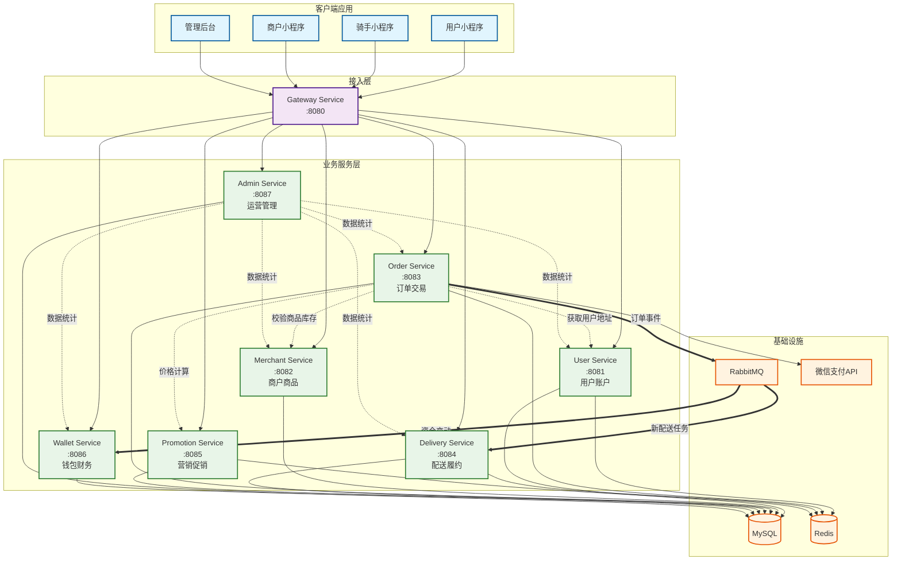
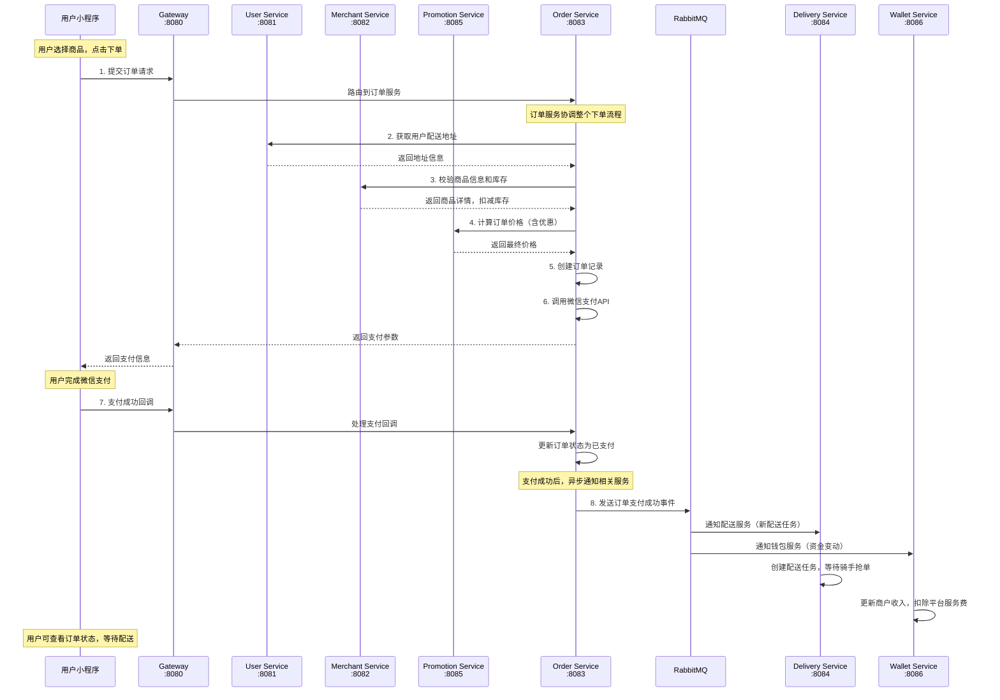
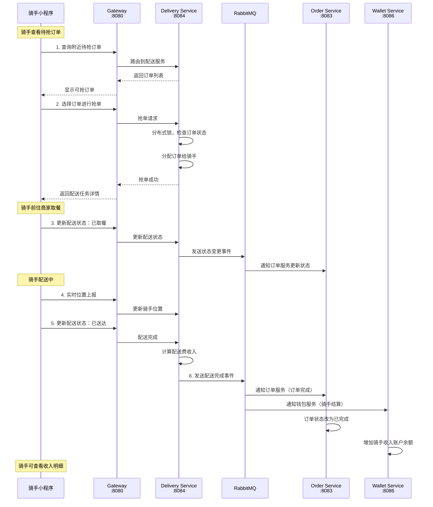
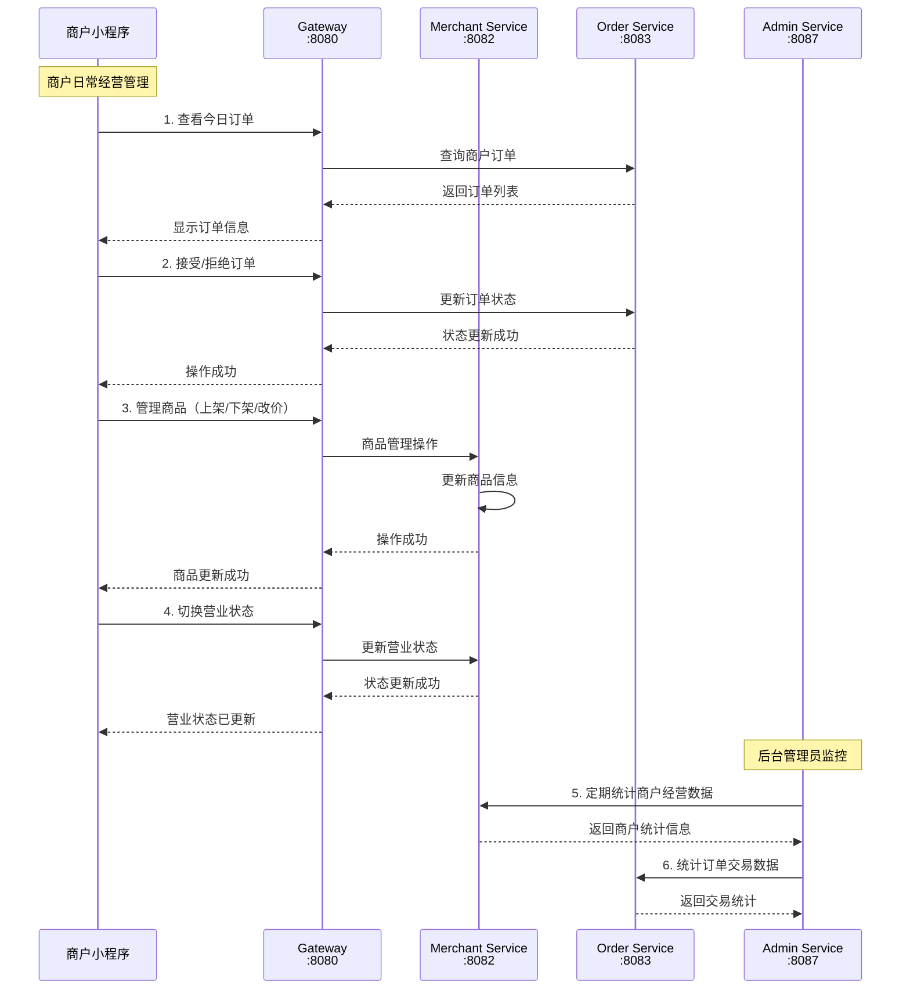
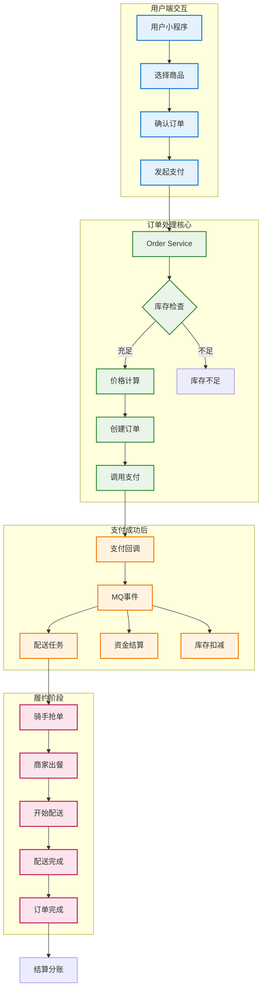

# 外卖平台微服务架构方案 - 可视化设计

## 1. 服务拆分总览表

| 服务名称 | 端口 | 核心职责 | 数据ownership | 主要对外API数量 | 部署优先级 |
|---------|------|----------|---------------|----------------|------------|
| `gateway-service` | 8080 | 统一入口控制 | 无业务数据 | 路由转发 | ⭐⭐⭐ 最高 |
| `user-service` | 8081 | 用户账户管理 | 用户信息、地址信息 | 8个 | ⭐⭐⭐ 最高 |
| `merchant-service` | 8082 | 商户商品管理 | 商户信息、商品信息、库存 | 12个 | ⭐⭐⭐ 最高 |
| `order-service` | 8083 | 订单交易管理 | 订单信息、支付记录 | 10个 | ⭐⭐⭐ 最高 |
| `delivery-service` | 8084 | 配送履约管理 | 骑手信息、配送任务 | 9个 | ⭐⭐ 高 |
| `promotion-service` | 8085 | 营销促销管理 | 优惠券、活动规则 | 7个 | ⭐ 中 |
| `wallet-service` | 8086 | 钱包财务管理 | 账户余额、资金流水 | 6个 | ⭐⭐ 高 |
| `admin-service` | 8087 | 运营管理工具 | 权限信息、系统配置 | 15个 | ⭐ 中 |

## 2. 服务职责矩阵表

| 功能领域 | Gateway | User | Merchant | Order | Delivery | Promotion | Wallet | Admin |
|---------|---------|------|----------|-------|----------|-----------|---------|-------|
| **用户管理** | 路由 | ✅主责 | - | - | - | - | - | 📊统计 |
| **商户管理** | 路由 | - | ✅主责 | - | - | - | - | 📊审核 |
| **商品管理** | 路由 | - | ✅主责 | 🔗调用 | - | - | - | 📊统计 |
| **订单管理** | 路由 | - | - | ✅主责 | 📤事件 | 🔗调用 | 📤事件 | 📊统计 |
| **支付管理** | 路由 | - | - | ✅主责 | - | 🔗调用 | 📤事件 | 📊统计 |
| **配送管理** | 路由 | - | - | 📤事件 | ✅主责 | - | 📤事件 | 📊统计 |
| **营销管理** | 路由 | - | - | 🔗调用 | - | ✅主责 | - | 📊配置 |
| **财务管理** | 路由 | - | - | - | - | - | ✅主责 | 📊统计 |
| **权限管理** | 🔒鉴权 | - | - | - | - | - | - | ✅主责 |

**图例**：✅主责 🔗同步调用 📤异步事件 📊数据统计 🔒权限控制

## 3. 服务依赖关系图



**图例说明**：
- **实线箭头**: 直接API调用
- **虚线箭头**: 同步调用（必须等待响应）
- **双线箭头**: 异步事件通信（通过MQ）

## 4. 核心业务流程图

### 4.1 用户下单流程



### 4.2 骑手配送流程



### 4.3 商户管理流程



## 5. 数据流转图



## 6. 服务能力评估表

| 服务 | 预估QPS | 主要瓶颈 | 扩展方案 | 监控重点 |
|------|---------|----------|----------|----------|
| Gateway | 1000+ | CPU/内存 | 多实例+负载均衡 | 响应时间、错误率 |
| User | 200 | 数据库连接 | 读写分离+缓存 | 登录成功率 |
| Merchant | 300 | 商品查询 | Redis缓存 | 商品查询延迟 |
| Order | 500+ | 数据库写入 | 分库分表 | 订单创建成功率 |
| Delivery | 200 | 位置计算 | 地理位置索引 | 抢单响应时间 |
| Promotion | 150 | 价格计算 | 算法优化+缓存 | 计算准确性 |
| Wallet | 100 | 资金安全 | 分布式事务 | 账务平衡检查 |
| Admin | 50 | 复杂查询 | 数据仓库 | 报表生成时间 |

## 7. 部署架构建议

### MVP阶段（单机部署）
```
[Nginx] → [Gateway] → [User|Merchant|Order|Delivery|Promotion|Wallet|Admin]
                           ↓
[MySQL Master] ← → [Redis] ← → [RabbitMQ]
```

### 扩展阶段（分布式部署）
```
[负载均衡] → [Gateway集群] → [微服务集群]
                              ↓
[MySQL集群] ← → [Redis集群] ← → [RabbitMQ集群]
```

这个可视化方案清晰展示了：
- ✅ **8个服务的职责边界**
- ✅ **服务间的调用依赖关系**
- ✅ **核心业务流程的服务协作**
- ✅ **数据流转和异步事件**
- ✅ **部署和扩展建议**

现在整个架构方案既有清晰的文字说明，又有直观的图表展示，非常适合与甲方进行技术对接！