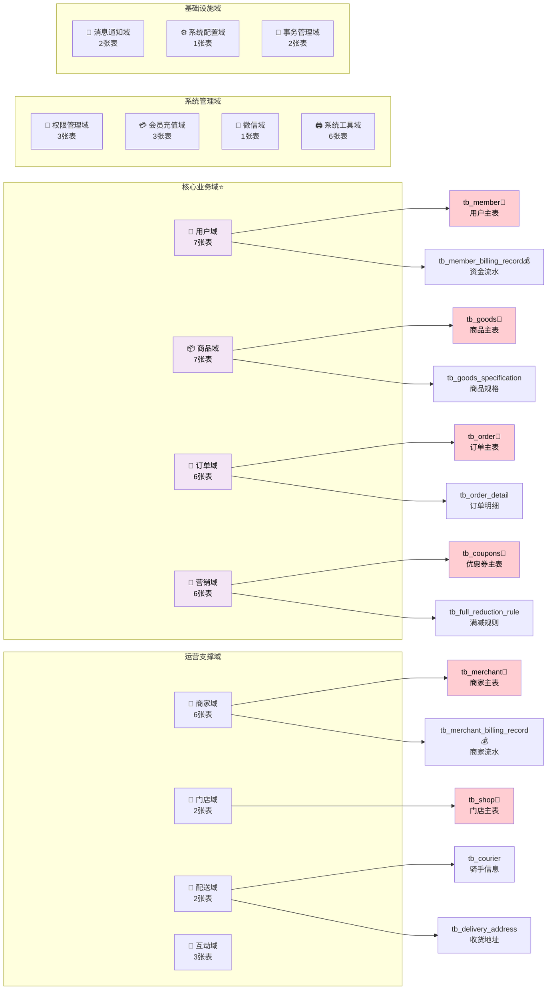
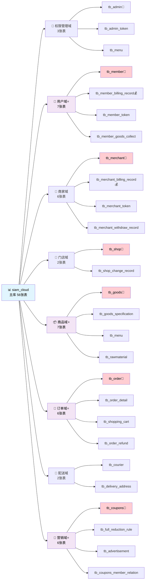
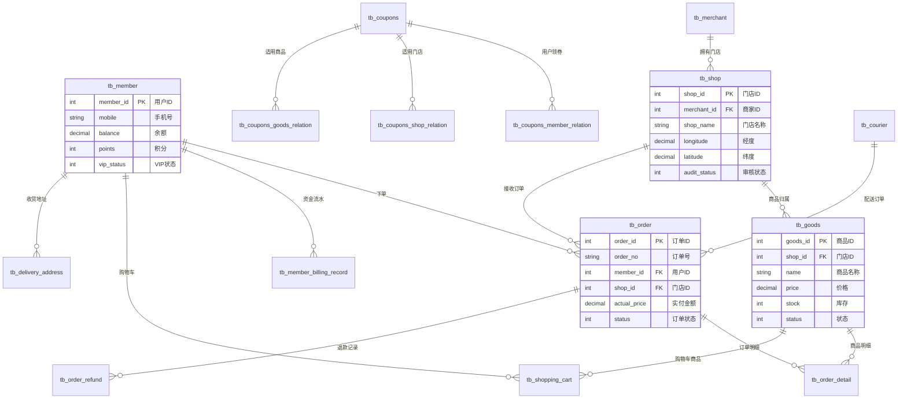
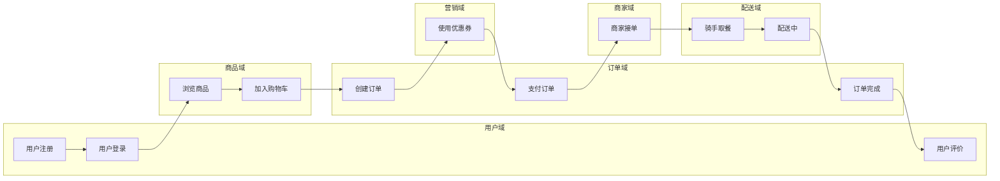

# 🎨 暹罗外卖数据库 Mermaid 架构图

## 📊 主库架构图（水平布局）

### 🎯 分层架构视图

### 🔗 详细展开视图

## 🛒 积分商城库架构图

```mermaid
graph TD
    A["📱 siam_cloud_mall<br/>积分商城库 17张表"] --> B["🏪 积分商品域<br/>6张表"]
    A --> C["🛒 积分订单域<br/>4张表"]
    A --> D["💰 积分营销域<br/>4张表"]
    A --> E["🔄 积分售后域<br/>3张表"]

    B --> B1["tb_points_mall_goods👑<br/>积分商品主表"]
    B --> B2["tb_points_mall_goods_specification<br/>积分商品规格"]
    B --> B3["tb_points_mall_menu<br/>积分商城分类"]
    B --> B4["tb_points_mall_*<br/>其他积分商品表"]

    C --> C1["tb_points_mall_order👑<br/>积分订单主表"]
    C --> C2["tb_points_mall_order_detail<br/>积分订单明细"]
    C --> C3["tb_points_mall_order_logistics<br/>积分订单物流"]
    C --> C4["tb_points_mall_shopping_cart<br/>积分购物车"]

    D --> D1["tb_points_mall_coupons<br/>积分优惠券"]
    D --> D2["tb_points_mall_coupons_*<br/>积分券关联表"]
    D --> D3["tb_points_mall_full_reduction_rule<br/>积分满减规则"]

    E --> E1["tb_points_mall_order_refund<br/>积分退款"]
    E --> E2["tb_points_mall_order_refund_goods<br/>积分退款商品"]
    E --> E3["tb_points_mall_order_refund_process<br/>积分退款流程"]

    style A fill:#e8f5e8
    style B1 fill:#ffcdd2
    style C1 fill:#ffcdd2
```

## 🔄 核心业务流程图

```mermaid
flowchart LR
    A["👤 用户登录<br/>tb_member"] --> B["🛍️ 浏览商品<br/>tb_goods<br/>tb_menu"]
    B --> C["🛒 加入购物车<br/>tb_shopping_cart"]
    C --> D["📝 创建订单<br/>tb_order<br/>tb_order_detail"]
    D --> E["💳 使用优惠<br/>tb_coupons<br/>tb_full_reduction_rule"]
    E --> F["💰 支付成功<br/>tb_member_billing_record"]
    F --> G["🏪 商家接单<br/>tb_merchant<br/>tb_shop"]
    G --> H["🚚 骑手配送<br/>tb_courier<br/>tb_delivery_address"]
    H --> I["✅ 完成订单<br/>tb_order status=completed"]
    I --> J["⭐ 用户评价<br/>tb_appraise<br/>tb_give_like"]

    style A fill:#e3f2fd
    style D fill:#fff3e0
    style F fill:#f1f8e9
    style I fill:#fce4ec
    style J fill:#f3e5f5
```

## 🗄️ 核心表关系图 (ER图)

## 📊 数据流向图

---

## 🎯 图表说明

### 📋 符号说明
- **👑**: 主表/核心表
- **⭐**: 核心业务域
- **💰**: 涉及资金流的表
- **🔄**: 系统技术表

### 🎨 颜色说明
- **蓝色**: 主库根节点
- **紫色**: 核心业务域
- **红色**: 主表/重要表
- **绿色**: 积分商城库

### 📖 使用建议
1. **架构了解**: 先看主库架构图和积分商城库架构图
2. **业务理解**: 重点关注核心业务流程图
3. **开发参考**: 使用ER图了解表关系
4. **数据流向**: 通过数据流向图理解完整业务链路

---

*📝 这些图表可以直接在支持 Mermaid 的平台（如 GitHub、GitLab、Notion 等）中渲染显示*
